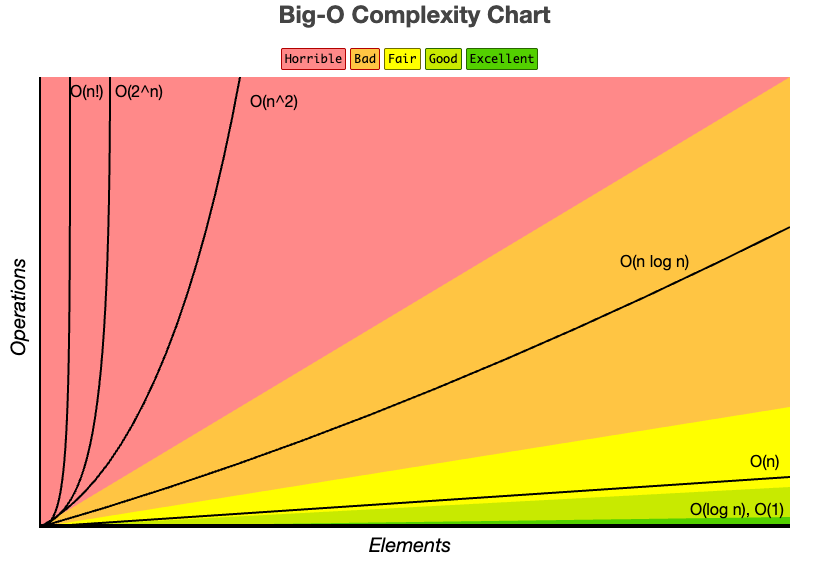

* toc
{:toc .large-only}
  [자료구조 - Data Structures with Python](https://www.youtube.com/playlist?list=PLsMufJgu5933ZkBCHS7bQTx0bncjwi4PK)강의를 듣고 정리한 내용입니다.<br>


<!--more-->

### 자료구조와 알고리즘

자료구조는 자료를 담는 그릇(구조)이고, 알고리즘은 그릇에 담긴 자료(입력데이터)를 여러 단계의 연산(명령)을 통해 원하는 값을 계산하는 논리적인 절차이다.

가장 간단한 자료구조는 C/C++ 등의 프로그래밍 언어의 기본 요소인 변수(variable)이고, 가장 널리 쓰이는 자료구조로는 배열(array), 구조체(struct)등을 예로 들 수 있다.

#### 인류 최초의 알고리즘 (GCD)

다음 코드는 두 수의 최대공약수를 구하는 함수를 세 가지 버전으로 작성한 것이다.

```python
def gcd_sub(a, b):	# 큰 수에서 작은 수를 반복적으로 빼며 계산
    while a != 0 and b != 0:
        if a > b:
            a = a - b
        else:
            b = b - a
    return a + b

def gcd_mod(a, b):	# 큰 수에서 작은 수로 나눈 나머지를 이용하여 계산
    while a != 0 and b != 0:
        if a > b:
            a = a % b
        else:
            b = b % a
    return a + b

def gcd_rec(a, b):	# gcd_mod의 재귀함수 버전
    if b == 0:
        return a
    return gcd_rec(b, a % b)

# 사용자 입력 받기
a, b = map(int, input("두 정수를 입력하세요: ").split())

# 함수 호출
x = gcd_sub(a, b)
y = gcd_mod(a, b)
z = gcd_rec(a, b)

# 결과 출력
print(x, y, z)

```


### 가상컴퓨터, 가상언어, 가상코드 (Virtual Machin, VPseudo Language, Pseudo code)

자료구조와 알고리즘의 성능은 대부분 수행시간(시간복잡도_time complexity)로 정의되는 것이 일반적이다. 이를 위해 실제 코드(java, python)등으로 구현하여 실제 컴퓨터에서 실행한 후, 수행시간을 측정하기도 하지만 HW/SW 환경을 하나로 통일해야 하는 어려움이 수반되기 때문에 <u>가상언어로 작성 된 가상코드를 가상컴퓨터에서 시뮬레이션하여 독립적인 계산환경 하에 측정</u>해야한다.

#### 가상컴퓨터 (Virtual Machine)

현재 가장 많이 사용되는 현실적인 가상 컴퓨터 모델은 RAM (Random Access Model)이며, <br>RAM모델은 CPU + memory + register + primitive operation으로 정의되는 가상컴퓨터 모델 중 하나이다.

- CPU : 연산을 수행
- memory : 임의의 크기의 실수를 저장할 수 있는 무한한 word로 구성
- register : CPU의 계산에 활용되는 충분한 개수의 독립 된 메모리
- 기본연산 : 단위 시간 내에 수행 될 수 있는 연산들로 정의
  1. **배정, 대입, 복사 연산** : A = B ( B를 읽어서 A에 쓴다 )
  2. **산술연산** : +, -, x, / ( 기본 사칙연산 )
  3. **비교연산** : >, >= , <=. != 
  4. **논리연산** : AND, OR, NOT
  5. **비트연산** : bit-AND, bit-OR, bit-NOT, bit-XOR, >>, <<

#### 가상언어 (primitive operation)

C, Python 같은 프로그래밍 언어보다 융통성 있는 언어로, Python과 유사하게 정의한다. 수학적/논리적으로 모호함 없이 명령어가 정의되기만 하면됨. 

- 배정, 산술, 비교, 논리, bit-논리 등의 기본연산 표현이 가능할 것
- 비교연산 if, else / if elif 등의 문법이 가능할 거 ㅅ
- 반복문이 가능할 것
- 함수를 정의하고 호출할 수 있을 것

#### 가상코드 (Pseudo Language)

가상언어로 작성된 코드. <br>ex) 배열 A의 n개의 정수 중에서 최대값을 계산하는 가상코드 등


## 알고리즘의 시간복잡도

가상컴퓨터에서 가상언어로 작성된 가상코드를 실행한다고 가정하였을 때, 특정 <u>입력에 대한 수행시간은 그 입력에 대해 수행되는 기본연산의 횟수로 정의</u>된다. 이 때 입력의 종류는 무한하므로 모든 입력에 대해 수행시간을 측정하여 평균을 구하는 것은 현실적으로 매우 까다롭다. 

따라서, 최악의 경우를 가정하여, **<u>최악의 경우의 입력값에 대한 알고리즘의 수행시간을 측정</u>**한다.

즉 **가장 안좋은 입력에 대한 <u>기본연산 횟수를 측정</u>**하는 것이다. (worstcase time complexity)

- **`ex` n개의 정수 중 최대값을 찾는 알고리즘**

  ```
  algorithm arrayMax(A, n)
  	input: n개의 정수를 저장한 배열 A
  	output: A의 수 중에서 최대값
  	currentMax = A[0]     (1번)
  	for i = 1 to n-1 do
  			if currentMax < A[i]		(n-1)번
  					currentMax = A[i]		(n-1)번
  	return currentMax
  ```

  if문의 결과에 따라 currentMax = A[i]의 실행 여부가 결정된다. <br>>> 최악의 경우, 입력은 무조건 currentMax = A[i]를 실행해야 하므로 if문이 항상 참이 되도록 하는 경우인데, 이와 같은 경우는 A에 저장 된 모든 값들이 오름차순으로 정렬 된 경우 일 것이다. 

  위 예시의 수행시간은 n에 대하여 2n-1이다. 

  > `해설`
  >
  > for문이 1번 돌 때, currentMax < A[i] 비교연산과 currentMax = A[i]대입연산이 2회로 일어나므로 숫자 n에 대해서 n-1번 for문이 돌면 총 2n-2의 연산이 수행되고, 초반 currentMax =A[0]에서 대입연산이 시행되었으므로 총 연산횟수는 2n-1 
  
  

## 알고리즘 시간복잡도 BigO

**[Big-O 표기법](https://www.bigocheatsheet.com/)** 



입력의 크기 n은 입력으로 주어지는 값의 개수로 정의할 때, 최악의 입력에 대한 기본연산의 횟수(알고리즘 수행시간)을 정확히 세는 건 번거롭다. 오히려 정확한 횟수보다는 입력의 크기 n이 커질 때, 수행시간 T(n)이 증가하는 정도가 성능을 판단하는데 훨씬 중요한 지표이므로, 우리는 이 증가도를 알고리즘의 성능으로써 판단하게 된다.

 T(n) = 2n + 5라면 상수항보다는 n의 일차항이 T(n)의 값을 결정하게 되고 T(n) = 3n<sup>2</sup> + 12n - 6 일 경우 n<sup>2</sup>항이 T(n)의 값을 결정하게 되ㅏ므로 일차항과 상수항을 생략해도 문제가 없는 것이다. 

이렇듯, 최고차항을 남기고 나머지는 생략하는 방식으로 수행시간을 간략히 표기하는 방법을 근사적 표기법이라고 부르고 대문자O를 사용하여 Big-O로 표현한다.

- T(n) = 2n+5 &rarr; O(n)
- T(n) = 3n<sup>2</sup> + 12n - 6  &rarr; O(n<sup>2</sup>)

#### 예시 
##### O(1)

**constant time algorithm**

```python
def increment_one(a):
	return a+1
```

##### O(log<sub>2</sub>n)

log의 밑은 2라고 가정하였을 때, n을 이진수로 표현했을 때의 비트수 계산

```python
def number_of_bits(n):
  count = 0
  	while n > 0:
      n = n // 2
      count += 1
  return count
```

예를 들어 n이 8이라고 할 때 while문을 통과하는 걸 보면 8 &rarr;4 &rarr;2&rarr;1 순으로 1/2씩 줄어드는 걸 확인할 수 있다. 즉 n번에 대해서 1/2 이므로 최종적인 줄어드는 수는 n * 1/2<sup>count</sup> 가 되므로1 = n * 1/2<sup>count</sup>의 양변에 로그를 취하면 **<u>O(log<sub>2</sub>n)</u>**를 얻는다.

##### O(n)

n개의 수 중에서 최대값을 찾는 알고리즘

##### O(n<sup>2</sup>)

두 배열 A,B의 모든 정수 쌍의 곱의 합을 계산하는 알고리즘

```python
def array_sum(A, B, n):
    total_sum = 0
    for i in range(n):
        for j in range(n):
            total_sum += A[i] * B[j]
    return total_sum
```

n번 도는  for문이 2번 존재하므로 n*n 으로 n<sup>2</sup>의 시간복잡도를 갖는다.

##### O(n<sup>3</sup>)

n x n인 2차원 행렬 A와 B의 곱을 계산하여 결과 행렬 C를 리턴하는 알고리즘

```python
def mult_matrices(A, B, n):
    # n x n 크기의 0으로 채워진 행렬 C 초기화
    C = [[0] * n for _ in range(n)]

    # 행렬 곱셈 수행
    for i in range(n):
        for j in range(n):
            for k in range(n):
                C[i][j] += A[i][k] * B[k][j]
    return C
```

n번 도는 for문이 3번 존재하므로 n^3이 되어 n<sup>3</sup>의 시간복잡도를 갖는다.

### 시간복잡도 비교

```python
import time
import random

def prefixSum1(X, n):
    """ O(n^2) 알고리즘 - 이중 반복문을 사용한 prefix sum """
    S = [0] * n  # 리스트를 0으로 초기화
    for i in range(n):
        for j in range(i + 1):  # i까지 포함해야 함
            S[i] += X[j]
    return S

def prefixSum2(X, n):
    """ O(n) 알고리즘 - 누적 합을 이용한 prefix sum """
    S = [0] * n
    S[0] = X[0]  # 첫 번째 요소 초기화
    for i in range(1, n):
        S[i] = S[i - 1] + X[i]  
    return S

random.seed()  # random 함수 초기화


n = int(input("n을 입력하세요: "))
X = [random.randint(1, n) for _ in range(n)]  # 1~n 범위 난수 생성

# prefixSum1 호출 및 실행 시간 측정
before = time.process_time()
S1 = prefixSum1(X, n)
after = time.process_time()
time1 = after - before

# prefixSum2 호출 및 실행 시간 측정
before = time.process_time()
S2 = prefixSum2(X, n)
after = time.process_time()
time2 = after - before

# 두 함수의 수행시간 출력
print(f"실행시간1 (O(n^2)): {time1:.6f} 초")
print(f"실행시간2 (O(n)): {time2:.6f} 초")

'''
> n을 입력하세요: 10000
실행시간1 (O(n^2)): 4.448287 초
실행시간2 (O(n)): 0.001292 초
'''
```

