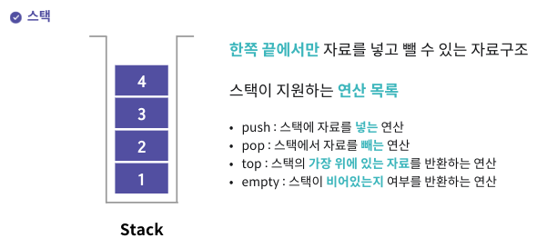
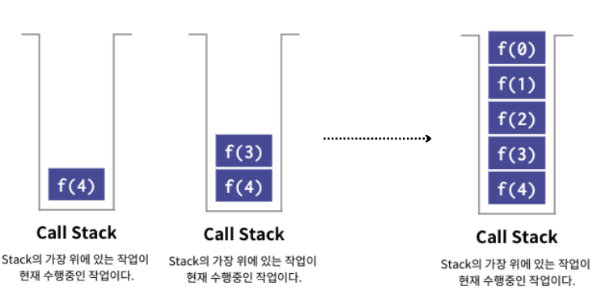
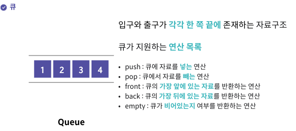

* toc
{:toc .large-only}
이어드림스쿨 자료구조 강의를 수강하며 배운 내용을 정리한 글 입니다.

스택과 큐에 관한 내용이 담겨있으며. 해당 자료규조를 python으로 구현한 코드와 그에 대한 해석을 추가적으로 정리하였습니다.


<!--more-->

## 스택(Stack) 



나중에 들어간 자료가 먼저 출력되는 구조로 LIFO(Last in First Out) 자료구조라고도 부른다.<br>파이썬의 리스트의 append, pop 등의 연산을 통해 스택을 구현할 수 있다.

### 대표적인 활용 예시

스택은 <u>**의존 관계가 있는 상태를 저장**</u>하므로, 어떤 일보다 더 먼저 처리되어야 하는 일이 있을 때 사용된다.

- **콜스택 - 팩토리얼 연산 (재귀함수)**
  

  ```python
  def factorial(n):
    if n==0:
      return 1
    return n* factorial(n-1)
  ```

## 큐 



먼저 들어간 자료가 먼저 출력되는 구조로 FIFO(First in First Out) 자료구조라고도 부른다.<br>배열을 통해서도 구현이 가능하지만 pop과 push를 반복하는 과정에서 인덱스가 배열의 크기를 초과하는 등의 문제점을 발생시킬 수 있다. 이러한 문제점을 보완하기 위해 나온 보통 연결 리스트로 큐를 구현하는데 이런 경우 `링크드 큐`라고 부른다.

삽입과 삭제가 제한되지 않고, 크기의 제한이 존재하지 않는다는 점이 이점으로 작용한다.<br>파이썬에서는 queue모듈의 Queue 클래스를 통하여 구현할 수 있다.

```python
import queue
q = queue.Queue()
```

### 대표적인 활용 예시

작업들간의 **<u>의존 관계가 없이, 작업이 병렬적으로 이루어져도 괜찮다면</u>** 큐에 저장하여 관리한다.

- **스케줄링**

  여러 프로세스를 동시에 수행할 수 있게 하기 위한 기법인 `시분할 시스템`을 비롯하여 운영체제의 스케줄링 알고리즘은 매우 다양하지만 대체로는 큐를 기반으로 스케줄링을 관리하고 있다.

  