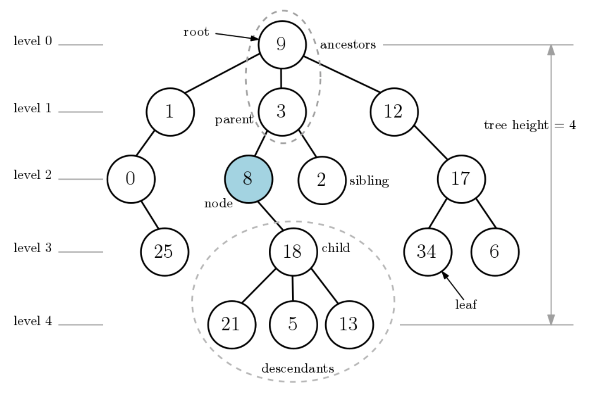
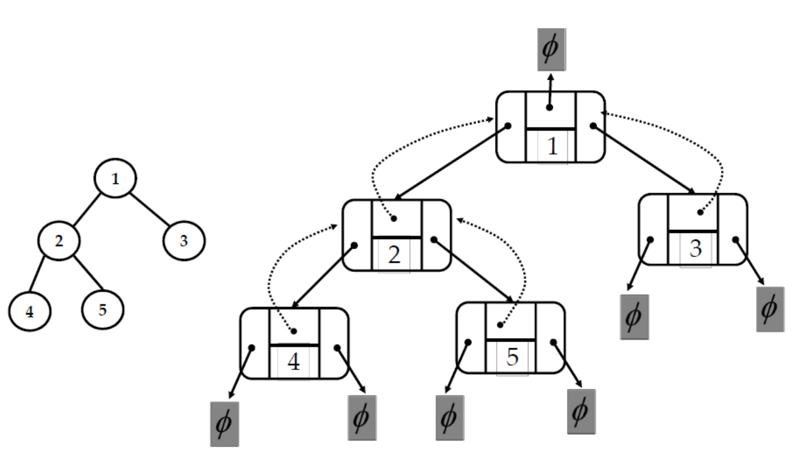
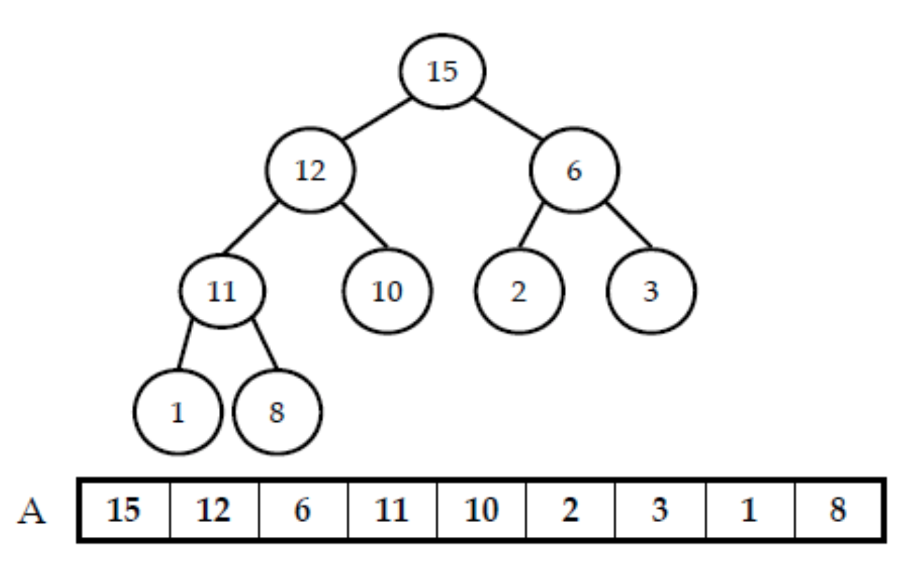

* toc
{:toc .large-only}
  [자료구조 - Data Structures with Python](https://www.youtube.com/playlist?list=PLsMufJgu5933ZkBCHS7bQTx0bncjwi4PK)강의를 듣고 정리한 내용입니다.<br>


<!--more-->

## 트리

트리는 부모-자식 관계에 따라 `노드(Node)`를 `엣지(Edge)`로 연결한 자료구조를 말한다.



- **path**
	- 두 노드를 연결하는 에지들을 순서대로 나열한 것으로 경로 길이(length)는 경로의 에지 개수로 정의한다
	- 트리에서의 두 노드의 경로는 유일하게 하나 뿐이다.
	
- **level**
	- 깊이(depth)는 루트노드에서 해당 노드까지의 경로의 길이로 정의한다.
	
	- 노드의 높이는 해당 노드에서 자손 노드까지의 가장 길이가 긴 경로의 경로길이로 정의한다.
	
	- 트리의 높이는 루트 노드의 높이로 정한다
	
	  &rarr; 위 그림에서 노드 34의 깊이는 9 - 12 -17- 34이므로 3이고, 노드 8의 높이는 길이가 2인 경로로 모든 자손 리프까지 도달할 수 있으므로 2가 되고, 루트 노드 9의 높이가 4이므로 트리 높이는 4가된다.

### 이진트리

 자식 노드가 최대 2개뿐인 트리를 일컫는다. 한 노드는 왼쪽/오른쪽 자식 노드를 가질 수 있다.



위의 그림을 보면 Node 하나에 최소 4개의 속성이 필요하다. (value, parent, left, right)

```python
class Node:
	def __init__(self, key, parent=None, left=None, right=None):
		self.key = key
		self.parent = parent
		self.left = left
		self.right = right

	def __str__(self):
		return str(self.key)

class Tree:
	def __init__(self):
		self.root = None
		self.size = 0
```

## 힙(Heap)



1차원 배열 중에서 저장된 값이 힙 조건(모양과 값 조건)을 만족하는 리스트(배열)을 의미한다.

* 힙의 모양 조건 : 리스트를 이진트리로 해석했을 때
  * 마지막 레벨을 제외한 각 레벨엔 빠짐없이 노드가 존재한다.
  * 마지막 레벨의 노드는 왼쪽부터 차례대로 빈틈없이 채워진다.
* 힙의 값 조건(heap property) 
  * <u>루트 노드를 제외한 모든 노드의 값은 부모 노드의 값보다 크지 않아야 한다. 또한 각 노드의 값은 자신의 자신 노드들의 값보다 같거나 커야 한다.</u>
* 노드 H[k]의 왼쪽/오른쪽 자식노드의 인덱스와 부모노드의 인덱스를 `O(1)`시간에 계산이 가능하다.
  * 왼쪽 - `H[2*K+1]` / 오른쪽 `H[2*K+1]`
  * 부모노드 - `H[(k-1)//2]`

### 힙 만들기 (make_heap)

```python
class Heap:
  def __init__(self, L=[]): # 입력 리스트가 없으면 빈 리스트를 default로 지정
    self.A = L
  def __str__(self):
    return str(self.A)
  def __len__(self):
    return len(self.A)
```

1. 리스트 A가 힙의 값 조건을 만족하지 않는다면, 값 조건을 만족하도록 리스트의 값을 재배열한다.
2. A[k] 는 자신의 자손 노드들고 같거나 커야한다. 이 성질을 만족하도록 A[k]를 자식노드의 값과 비교하면서 더 큰 값을 갖는 자식노드와 swap하는 과정을 더 이상 필요가 없을 때까지 반복한다. 이 과정을 `heapify_down`으로 작성한다
   1. `heapify_down(k, n)`: A[k]가 밑으로 내려가면서 heap 성질을 만족하는 위치로 보냄 (`n`은 heap의 노드 수 이며 heap_sort를 위해 필요한 매개변수)
3. 이후 마지막 노드인 A[n-1]부터 첫 노드 A[0]까지 차례로 `heafiy_down`을 호출해 `make_heap`을 완성한다.

```python
def heapify_down(self, k, n): 
# n = 힙의 전체 노드수 [heap_sort를 위해 필요함]
# A[k]가 힙 성질을 위배한다면, 밑으로 
# 내려가면서 힙성질을 만족하는 위치를 찾는다
while 2*k+1 < n:           # k의 왼쪽 자식 노드가 힙 범위(n)에 있는지 확인 / 자식이 있으면 더 이상 비교하거나 내려갈 필요 없으므로 종료
	L, R = 2*k + 1, 2*k + 2	 # L : 왼쪽 자식 인덱스 , R : 오른쪽 자식 인덱스
	if L < n and self.A[L] > self.A[k]: 
		m = L
	else: 
		m = k
	if R < n and self.A[R] > self.A[m]: 
		m = R # m = A[k], A[L], A[R] 중 최대값의 인덱스
	if m != k:	# A[k]가 최대값이 아니라면 힙 성질 위배
		self.A[k], self.A[m] = self.A[m], self.A[k]
		k = m
	else: break	# 현재 노드 k가 자식들보다 크거나 같다면 힙 성질을 만족하므로 더이상 내려갈 필요없으므로 종료

def make_heap(self):
	n = len(self.A)
	for k in range(n-1, -1, -1): # A[n-1] → ... → A[0]
		self.heapify_down(k, n)
```

