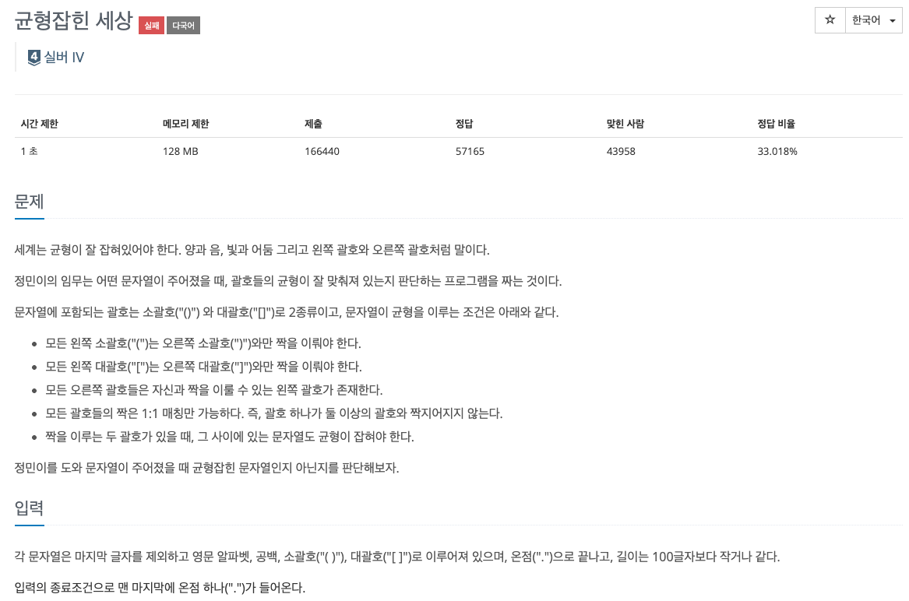

* toc
{:toc .large-only}
백준 4949번 문제에 대한 풀이과정을 정리한 글입니다.

스택 자료구조로 분류되는 문제유형으로 처음에는 deque로 구현하려 해서 여러차례 실패하여 사고의 흐름을 기억하기 위해 적고, 또 옳은 풀이 방법이 왜 옳은지 추가적으로 서술하였습니다.

<!--more-->



### 📌정답

```python
import sys

pairs = {']': '[', ')': '('}

while True:
    sentence = sys.stdin.readline().rstrip()
    if sentence == '.':
        break

    answer = 'yes'
    stack = []

    for char in sentence:
        if char == '[' or char == '(':
            stack.append(char)
        elif char == ']' or char == ')':
            if not stack or pairs[char] != stack.pop():  # 스택이 비어있거나 짝이 맞지 않으면
                answer = 'no'
                break
    if stack:  # 스택에 여는 괄호가 남아있다면 불균형
        answer = 'no'

    print(answer)
```

### 풀이과정

#### 1. 덱으로 구현한 경우 (오답)

```python
import sys
from collections import deque

pairs={'[':']' , '(':')'}
sentences = []

for line in sys.stdin:
    line = line.strip()
    sentences.append(line)
    if line == '.':
        break

answers = []

for sentence in sentences:
    q = deque(sentence)
    answer = 'yes'
    while len(q) > 0:
        left = q.popleft()
        if left == ']' or left == ')':
            answer = 'no'
            break
        if left == '[' or left == '(':
            answer = 'no'
            while len(q) > 0:
                right = q.pop()
                if pairs[left] == right:
                    answer = 'yes'
                    break
    answers.append(answer)

for answer in answers:
    print(answer)
```

> **✅ 괄호검사 로직** 
>
> 1. 앞에서부터 문자를 `popleft()`로 꺼낸다. 이 때  `']'` 또는 `')'`가 먼저 나오면 균형이 깨진 것이므로 `answer = 'no'`로 설정하고 즉시 반복문을 종료.
> 2. 만약 `'['` 또는 `'('`가 나오면 오른쪽에서 짝이 맞는 `']'` 또는 `')'`를 찾기 위해 `right = q.pop()`을 사용하여 뒤에서부터 문자를 꺼내며 `pairs[left]`와 비교. 짝이 맞으면 answer = yes로 바꾸고 짝을 찾지 못하는 경우 answer는 초기값인 no로 그대로 유지된다. 

##### 반례 : `[(a)][()].` 

괄호가 반드시 [], () 순서대로 되어있지 않을 수 있고 섞여있을 수 있는 가능성을 무시하고 코드를 작성하였다. 위의 반례를 보면 [ ( a 순으로 요소가 제거된 후 ) 가 나오면 이후로 맞는 짝을 찾을 수 없어 균형이 무너졌다고 판단하고 answer에 no가 할당된다. 하지만 순서의 문제일 뿐 균형이 맞춰진 상태로 해당 예시의 답은 yes여야 한다.

##### 스택을 사용해야 하는 이유

1. 주어진 문장의 앞요소와 뒷 요소를 구분해서 검사하지 않고, **앞 요소부터 순차적으로 검사**해야한다. <br>가장 처음에 열린 괄호가 가장 뒤의 괄호와 짝일거라는 보장이 없기 때문에 앞/뒤를 구분해서 검사하는 것은 의미가없다.
2. 앞 요소부터 검사하며 열린괄호(`(`,`[`)가 나온 경우, 해당 요소를 stack 자료구조에 삽입한다. <br>후에 **<u>닫힌 괄호가 나왔을 경우 가장 마지막에 삽입 된 열린 괄호와 짝이 맞는지 판단</u>**해야하므로 '후입선출'구조의 스택이 가장 적절한 풀이다. 

#### 2. 스택으로 구현한 풀이 (오답)

```python
import sys
from collections import deque

pairs={']':'[' , ')':'('}

while True:
    sentence = sys.stdin.readline().rstrip()
    if sentence == '.':
        break

    answer = 'yes'
    stack = []

    for char in sentence:
        if char == '[' or char == '(':
            stack.append(char)
        elif char == ']' or char == ')':
            if not stack or pairs[char] != char:  # 스택이 비어있거나 짝이 맞지 않으면
                if not stack or pairs[char] != stack.pop():  # 스택이 비어있거나 짝이 맞지 않으면
                    answer = 'no'
                    break
    print(answer)
```

맞게 짠 것 같은데 10% 정도에서 계속 틀렸습니다.가 출력되서 굉장히 스트레스. 해결에만 2시간은 족히 쓴 듯 하다. 아주 멍청하게도 괄호의 짝을 맞추는데만 혈안이 되었는데 그걸 닫힌 괄호만 중점적으로 생각했다. 짝을 다 맞추고 나서 열린 괄호가 남아있을 경우에 대한 반례를 생각하지 않았다. 

```python
if stack:  # 스택에 여는 괄호가 남아있다면 불균형
    answer = 'no'
```

해당 코드를 print(answer) 직전에 추가하여 해결하였다. 

