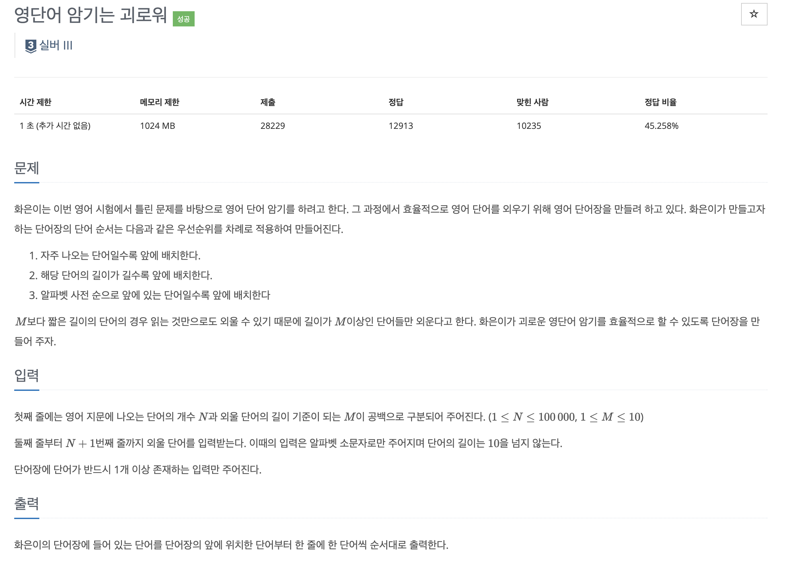

* toc
{:toc .large-only}
백준 20920번 문제에 대한 풀이과정을 정리한 글입니다.

자체로 어려운 문제는 아니지만 정렬조건이 많았기 때문에 python의 Counter를 활용 한 뒤 람다식을 이용해 정렬을 하는 과정이 기억할만하다 하여 정리하였습니다.

<!--more-->



### 📌정답

```python
from collections import Counter
import sys

n, k = map(int,sys.stdin.readline().rstrip().split())
words = []
order = {}

for i in range(n):
    word = sys.stdin.readline().rstrip()
    if len(word) >= k:
        words.append(word)
        order[word] = i

c = Counter(words)

sorted_items = sorted(c.items(), key=lambda x: (-x[1], -len(x[0]), x[0], order[x[0]]))
for a, b in sorted_items:
    print(a)
```

### 풀이과정

문제의 정렬조건은 총 3가지지만 중간에 정렬조건을 한 가지 잘못 이해하여 추가 된 조건이 있는데, 이 조건을 풀기 위해 정렬의 람다식에 처음 써보는 방식을 적용했기 때문에 이를 기억하기 위해 이 조건이 있다고 가정하고 풀어보았다.

- 빈도수
- 단어의길이
- 사전순
- 원래 입력순

```python
n, k = map(int,sys.stdin.readline().rstrip().split())
words = []
order = {}

for i in range(n):
    word = sys.stdin.readline().rstrip()
    if len(word) >= k:
        words.append(word)
        order[word] = i

c = Counter(words)
```

첫번째로 해당 문제에는 `특정길이(k)`이상인 단어만 외운다는 조건이 있었기 때문에 입력값을 받는 과정에서 이를 걸러주었고,  '원래 입력순'이라는 정렬 조건을 위해 각 입력값이 입력되는 순서를 입력값과 함께 저장할 수 있는 dictionary를 함께 선언한 후 값을 입력한다.

이후 `c=Counter(words)`카운터 정렬을 통해 빈도수가 높은 순서대로 정렬한다.

```python
sorted_items = sorted(c.items(), key=lambda x: (-x[1], -len(x[0]), x[0], order[x[0]]))
for a, b in sorted_items:
    print(a)
```

이후 정렬조건을 만족하기 위해 람다식을 활용합니다. 해당 줄을 코드로 풀어써보면 아래와 같다. 

```python
def sorting_key(x):
    word = x[0]        # 단어 (예: 'apple')
    count = x[1]       # 등장 횟수 (예: 3)
    length = len(word) # 단어 길이 (예: 5)
    order_index = order[word]  # 입력 순서 인덱스 (예: 0)

    return (-count, -length, word, order_index)

sorted_items = sorted(c.items(), key=sorting_key)
```

sorting_key에 c에 포함된 요소 뿐 아니라 c의 요소를 사용해서 뽑아낸 order[word]가 사용 가능하다는 점을 기억하자!

### Java 풀이

```java
import java.io.*;
import java.util.*;

public class Main {
    public static void main(String[] args) throws IOException {
        // 입력 처리
        BufferedReader br = new BufferedReader(new InputStreamReader(System.in));
        StringTokenizer st = new StringTokenizer(br.readLine());

        int n = Integer.parseInt(st.nextToken());
        int k = Integer.parseInt(st.nextToken());

        Map<String, Integer> map = new HashMap<>();

        for (int i = 0; i < n; i++) {
            String word = br.readLine().trim();
            if (word.length() >= k) {
                map.put(word, map.getOrDefault(word, 0) + 1);
            }
        }

        // 리스트로 변환 후 정렬
        List<String> wordList = new ArrayList<>(map.keySet());

        wordList.sort((a, b) -> {
            int freqCompare = map.get(b) - map.get(a); // 등장 횟수 내림차순
            if (freqCompare != 0) return freqCompare;

            int lenCompare = b.length() - a.length();  // 길이 내림차순
            if (lenCompare != 0) return lenCompare;

            return a.compareTo(b); // 알파벳 오름차순
        });

        // 출력
        StringBuilder sb = new StringBuilder();
        for (String word : wordList) {
            sb.append(word).append("\n");
        }
        System.out.print(sb);
    }
}

```

