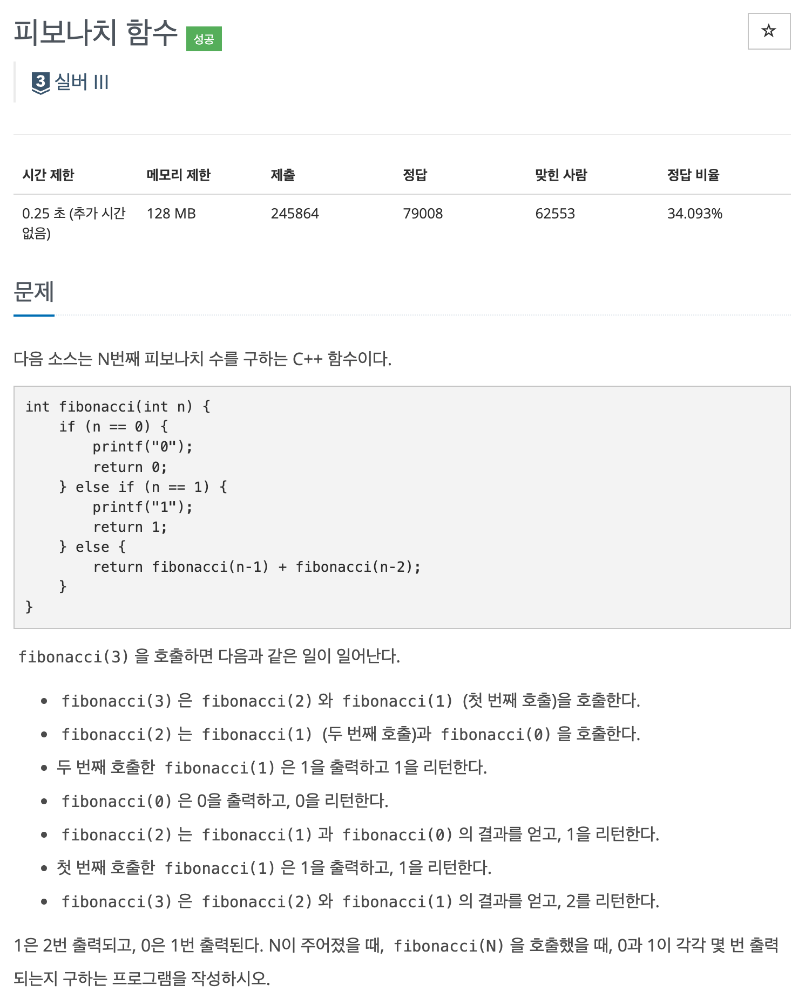
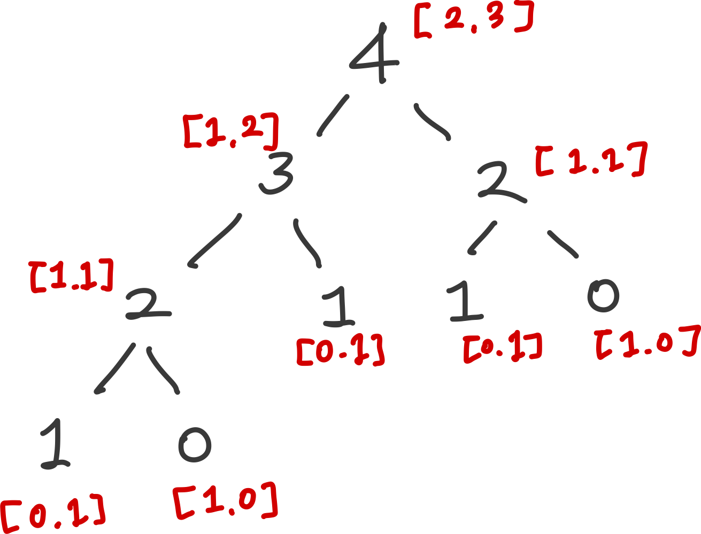

* toc
{:toc .large-only}
백준 1003번 문제에 대한 풀이과정을 정리한 글입니다.

다이나믹 프로그래밍이 활용되는 피보나치 수열에 대한 문제로, 다이나믹 프로그래밍에 대한 개념을 확실히하기 위해 정리하였습니다.

<!--more-->



### 📌 정답

```python
T = int(input())  # 테스트 케이스 개수

dp = [[0, 0] for _ in range(41)]

# 초기 조건
dp[0] = [1, 0]  # fib(0) 호출 시: 0이 1번, 1이 0번 출력
dp[1] = [0, 1]  # fib(1) 호출 시: 0이 0번, 1이 1번 출력

for i in range(2, 41):
    dp[i][0] = dp[i-1][0] + dp[i-2][0]
    dp[i][1] = dp[i-1][1] + dp[i-2][1]

# 테스트 케이스 처리
for _ in range(T):
    n = int(input())
    print(dp[n][0], dp[n][1])
```

#### 풀이과정

1. 문제는 각 피보나치 수열의 값이 호출 될 때, 0과 1이 몇번 더해지냐는 것이다. 피보나치 수열은 전과 전전의 숫자를 더해서 나오는 숫자로 결국 재귀적으로 들어가면 모든 수는 0과 1을 기반으로 쭉 더해져서 나타나는 걸 알 수 있다. {: style="width:50%; height:50%;" }

2. 0과 1의 횟수를 리스트 안의 리스트 형태로 저장. 상위의 0,1 등장횟수는 하위 자식의 각 등장횟수 list[0]들의 합, list[1]들의 합과 같은 걸 알 수 있다. 따라서 문제 조건인 40이하의 리스트를 미리 만들어놓고 리스트 내 리스트의 형태로 각값에 1과 0이 몇번 등장했는지를 합으로 구해서 미리 저장해둔다. 

   ```python
   for i in range(2, 41):
       dp[i][0] = dp[i-1][0] + dp[i-2][0]
       dp[i][1] = dp[i-1][1] + dp[i-2][1]
   ```
