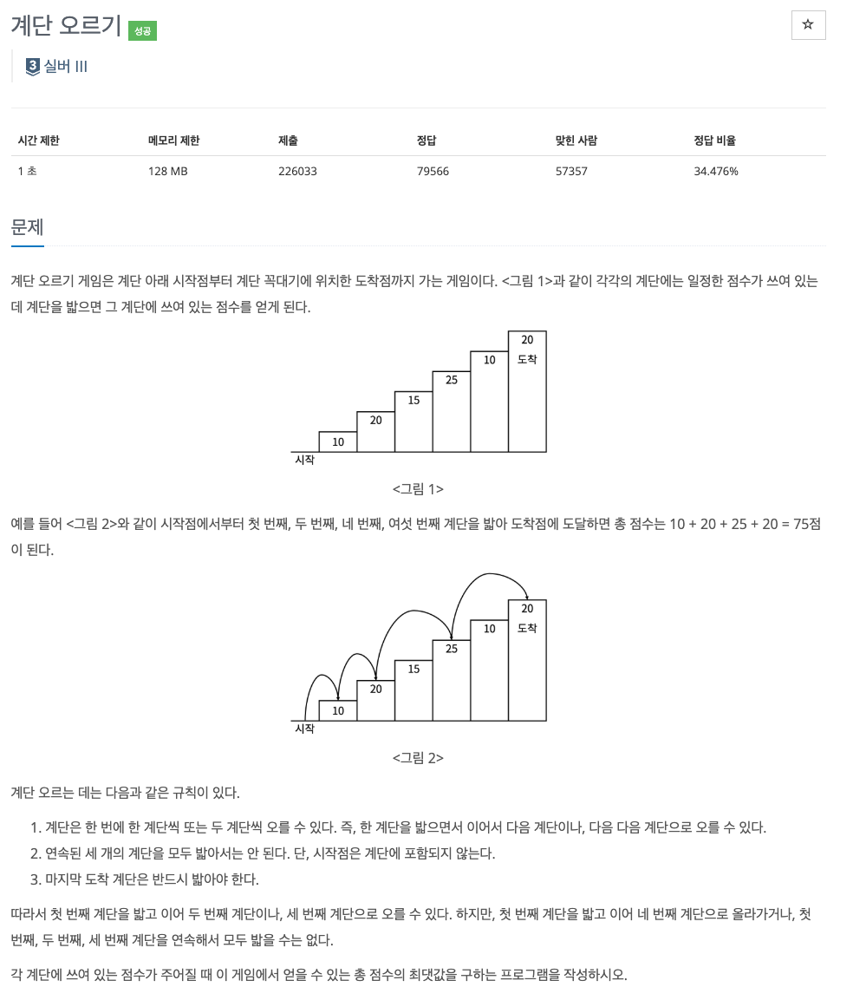

* toc
{:toc .large-only}
백준 2579번 문제에 대한 풀이과정을 정리한 글입니다.

다이나믹 프로그래밍의 대표적인 예중 하나인 계단 오르기 문제로, 다이나믹 프로그래밍에 대한 개념을 확실히하기 위해 정리하였습니다.

<!--more-->



### 📌 정답

```python
import sys

n = int(sys.stdin.readline())
steps = [int(sys.stdin.readline()) for _ in range(n)]

dp = [0] * n

if len(steps)<=2:
    print(sum(steps))
else:
    dp[0] = steps[0]
    dp[1] = steps[0] + steps[1]
    for i in range(2,n):
        dp[i] = max(dp[i-3]+steps[i-1]+steps[i], dp[i-2]+steps[i])
    print(dp[-1])
```

#### 풀이과정

>  계단을 오르면서 밟은 계단들의 점수의 합이 **최대**가 되도로 경로를 선택한다. 단 3계단을 연속으로 밟을 수 없다.

**<mark>dp[i]</mark>** = i번째 계단까지 왔을 때 얻을 수 있는 최대 점수를 저장하도록 한다.

- **점화식 : 계단을 오를 때 가능한 경우의 수**
  - **한 계단 전에서 올라온 경우**
    - 단 i-1도 밟고 있으므로 i-2는 밟지 않아야 함 &rarr; `dp[i] = dp[i-3]+steps[i-1]+steps[i]`
    - i-3번째 계단까지 오르고, i-1, i를 연속으로 밟음
  - **두 계단 전에서 올라온 경우** 
    - `dp[i] = dp[i-2] + steps[i]`
    - i-2까지 오르고, i를 밟음(i-1은 생략됨)
  - <u>위의 두가지 경우 중 더 큰 경우를 선택해야 하므로 max(a,b)를 활용</u>
