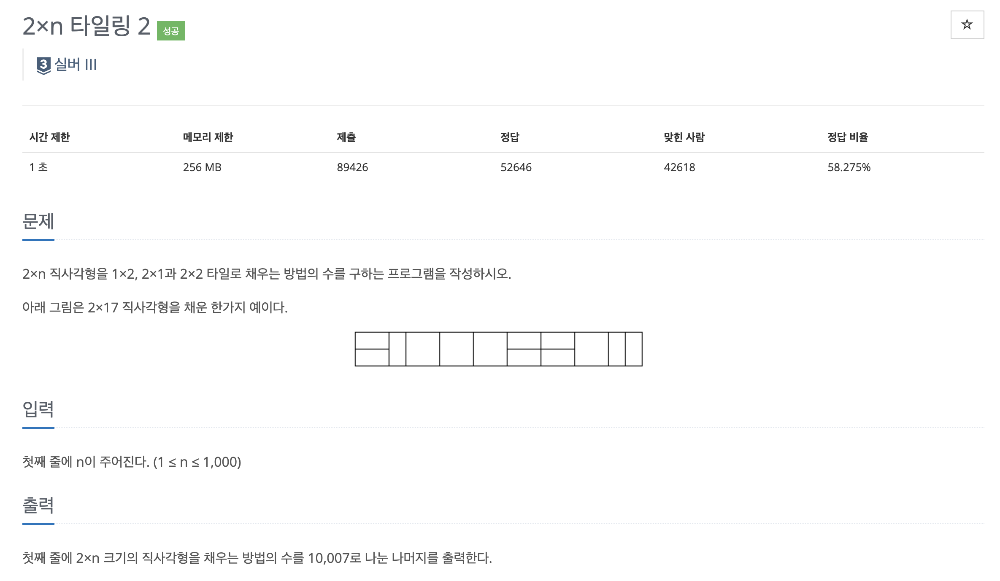

* toc
{:toc .large-only}
백준 11727번 문제에 대한 풀이 과정을 정리한 글입니다.

DP 개념이 아직 완전히 익숙하지 않아, 해당 개념을 보완하기 위해 추가적인 정리를 하였습니다.
특히 DP의 핵심인 <u>“큰 문제를 작은 문제로 나누고, 작은 문제의 해를 바탕으로 전체 문제를 해결하는 방식”</u>이 이번 문제에서는 식을 세우는 흐름이 논리적으로 잘 드러나 글로 정리하기에 적합하다고 판단해, 그 과정을 단계별로 자세히 풀어 작성해보았습니다.

<!--more-->




### 📌 정답

```python
n = int(input())

dp = [0] * (n + 1)
dp[1] = 1
if n >= 2:
    dp[2] = 3

for i in range(3, n + 1):
    dp[i] = dp[i-1] + 2 * dp[i-2]
    dp[i] %= 10007

print(dp[n])
```

### 풀이과정

처음 이 문제를 접했을 때는 `2×n` 크기의 직사각형을 여러 개의 `2×2` 블록으로 나눠보고, 각 블록을 채우는 다양한 방법(예: `2×2`로 채우기, `1×2` 두 개로 채우기, `2×1` 두 개로 채우기)을 조합해 일종의 수열 문제처럼 접근하려고 했다.

하지만 생각할수록 `2×2` 타일이 중간에 끼어 있을 때, 그 양옆을 어떤 타일로 채우느냐에 따라 경우의 수가 복잡하게 분기되었고, 특히 `n`이 짝수인지 홀수인지에 따라 전체 경우의 수가 다르게 나타나는 등 점화식을 만들 수 없을 정도로 경우의 수가 폭발했다.

이 과정을 통해 한 가지 중요한 사실을 깨달았다.
 바로 **<mark>DP에서의 핵심은 "최종 상태를 가장 작은 단위로 쪼개고, 그 쪼갠 상태가 이전 값들과 어떤 관계를 가지는지를 파악하는 것</mark>**이라는 점이다.
 이 문제도 마찬가지로, 타일을 배치하는 방식을 "마지막에 어떤 타일을 놓았는가"로 나누어 접근해야 한다는 점에서 실마리를 찾을 수 있었다.

> 이 문제는 `2×n` 크기의 직사각형을 `1×2`, `2×1`, `2×2` 타일을 이용해 빈틈없이 채우는 경우의 수를 구하는 **동적 계획법(DP)** 문제이다.

####  1. 문제를 나누는 기준: 마지막에 놓은 타일

DP 문제에서 가장 중요한 것은 **문제를 어떻게 작은 문제로 쪼갤 것인가**이다.  
이 문제는 **마지막에 어떤 타일을 놓았는지**를 기준으로 나누는 것이 핵심이다.  
왜냐하면 마지막 타일이 무엇이었는지를 알게 되면,  
그 이전의 공간은 항상 `2×(n-1)` 또는 `2×(n-2)`로 고정되기 때문에  
**이미 구해둔 작은 문제의 해를 재사용**할 수 있기 때문이다.

---

####  2. 세 가지 경우의 수

`dp[n]`을 `2×n` 직사각형을 채우는 방법의 수라고 할 때,  
마지막에 놓는 타일의 종류에 따라 다음 세 가지 경우로 나눌 수 있다:

1. **마지막에 `2×1` 타일을 세로로 놓은 경우**
   - 남은 공간: `2×(n-1)`
   - 경우의 수: `dp[n-1]`

2. **마지막에 `1×2` 타일 두 개를 가로로 쌓은 경우**
   - 남은 공간: `2×(n-2)`
   - 경우의 수: `dp[n-2]`

3. **마지막에 `2×2` 타일을 하나 놓은 경우**
   - 남은 공간: `2×(n-2)`
   - 경우의 수: `dp[n-2]`

---

####  3. 점화식 도출

위 세 가지 경우를 모두 고려하면 다음과 같은 점화식을 얻을 수 있다:

```python
dp[n] = dp[n-1] + 2 * dp[n-2]
```

#### 4. 초기 조건

```python
dp[1] = 1  # 세로 타일 하나
dp[2] = 3  # (2×1 + 2×1), (1×2 + 1×2), (2×2)
```

---

이 문제를 풀면서 단순히 타일의 모양을 조합하는 것만으로는 경우의 수를 정리하기 어렵다는 점을 느꼈고, DP의 핵심인 **“작은 문제의 해를 재활용해서 큰 문제를 푼다”는 사고 방식**을 통해
비로소 정답에 도달할 수 있었다. 특히 **“마지막 타일이 무엇이었는지”**를 기준으로 문제를 나눠보는 방식은 앞으로 다양한 DP 문제를 해결하는 데에도 큰 도움이 될 것이다.
