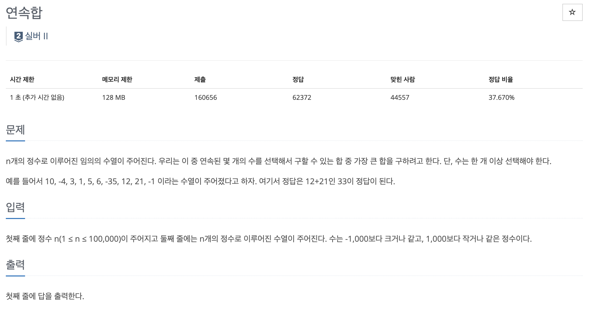
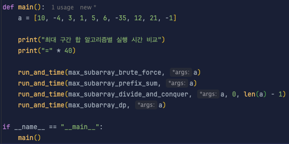
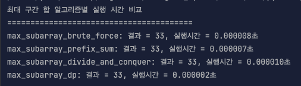

* toc
{:toc .large-only}
백준 1912번 문제에 대한 풀이과정을 정리한 글입니다.

주어진 리스트의 최대합을 구하는 과정을 브루트포스, prefix_sum, 분할정복, dp 4가지의 방식으로 풀이하고 각 방법에 대한 해설 그리고 실행시간의 차이를 비교하여 정리하였습니다.

<!--more-->



### 📌 정답

```python
def max_subarray_dp(a):
    max_sum = current_sum = a[0]
    for i in range(1, len(a)):
        current_sum = max(a[i], current_sum + a[i])
        max_sum = max(max_sum, current_sum)
    return max_sum

n = int(input())
numbers = list(map(int, input().split()))

print(max_subarray_dp(numbers))
```

### 풀이과정

#### 1. 중첩 for문을 통한 풀이 (브루트포스)

```python
def max_subarray_bruteforce(a):
  n = len(a)
  max_sum = float('-inf')	# 가장 작은 수로 초기화
  
  for i in range(n):
    current_sum = 0
    for j in range(i, n):
      current_sum += a[j] # i~j 까지의 누적합 계산
      max_sum = max(max_sum, current_sum) # max 비교를 통해 결과 도출 
      
 	return max_sum
```

> 모든 구간 `[i:j]`에 대하여 각각의 값을 구하고, 이전에 저장해놓은 값과 max() 함수를 통해 비교하면서 최대값 도출 

- 각 for문 마다 n회 loop를 돌기 때문에 **n<sup>2</sup>**의 시간복잡도를 갖게된다.

#### 2. 누적합 배열 (prefix_sum)

```python
def max_subarry_prefix_sum(a):
  n = len(a)
  p = [0] * (n+1)	# 각 인덱스까지의 합을 담아놓을 누적합배열 선언
  
  for i in range(n):
    p[i+1] = p[i] + a[i] #누적합 생성
    
  max_sum = float('-inf')
  for i in range(n):
    for j in range(i+1, n+1):
      sub_sum = p[j] - p[i]
      max_sum = max(max_sum, sub_sum)
      
  return max_sum    
```

> 미리 누적합 배열을 지정해놓고 
>
> a[i:j] 구간의 합은 `prefix[j+1] - prefix[i]`로 한번에 구한다.

- 누적합 만들기: O(N)
- 구간 계산 반복: O(N²)

#### 3. 분할정복법

```python
def max_crossing_sum(a, left, mid, right):
    left_sum = float('-inf')
    temp_sum = 0
    for i in range(mid, left - 1, -1):
        temp_sum += a[i]
        left_sum = max(left_sum, temp_sum)

    right_sum = float('-inf')
    temp_sum = 0
    for i in range(mid + 1, right + 1):
        temp_sum += a[i]
        right_sum = max(right_sum, temp_sum)

    return left_sum + right_sum

def max_subarray_divide_and_conquer(a, left, right):
    if left == right:
        return a[left]

    mid = (left + right) // 2
    left_max = max_subarray_divide_and_conquer(a, left, mid)
    right_max = max_subarray_divide_and_conquer(a, mid + 1, right)
    cross_max = max_crossing_sum(a, left, mid, right)

    return max(left_max, right_max, cross_max)
```

> 배열을 절반으로 나눠서 재귀적으로 최대 구간합을 구한다.
>
> 1. 왼쪽 반에서 최대 
> 2. 오른쪽 반에서 최대 
> 3. 중간을 포함한 최대

- **O(N log N)**

#### <span style="color:red">4. 동적계획법</span>

```python
def max_subarray_kadane(a):
    max_sum = current_sum = a[0]

    for i in range(1, len(a)):
        current_sum = max(a[i], current_sum + a[i])
        max_sum = max(max_sum, current_sum)

    return max_sum

```

> 현재 위치까지의 최대 연속합을 저장하면서 진행 <br>&rarr; 현재까지 누적한 값이 음수라면 버리고 새로 진행

```gherkin
a = [1, -1, 3, -4, 5, -4, 6, -2]
current_sum: 1 → 0 → 3 → -1 → 5 → 1 → 7 → 5
max_sum 업데이트: 1 → 3 → 5 → 7
```

- **O(N)**

| 방법             | 아이디어             | 시간 복잡도 | 속도        | 장점                 | 단점                |
| ---------------- | -------------------- | ----------- | ----------- | -------------------- | ------------------- |
| Brute Force      | 모든 경우 순회       | O(N²)       | 🐢 느림      | 구현 쉬움            | 느림                |
| Prefix Sum       | 누적합으로 합 계산   | O(N²)       | 🐢 느림      | 합 계산은 빠름       | 중첩 반복문         |
| Divide & Conquer | 분할정복, 재귀       | O(N log N)  | ⚖️ 중간      | 알고리즘 연습에 좋음 | 코드 복잡           |
| Kadane (DP)      | 현재까지 최대 연속합 | O(N)        | ⚡ 매우 빠름 | 가장 빠름            | 음수 처리 주의 필요 |

#### 실제 시간 비교




