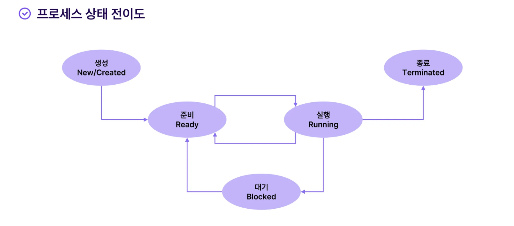

* toc
{:toc .large-only}
<!--more-->

## 프로세스

프로세스는 쉽게 말해 실행 중인 프로그램이다. 운영체제에서 프로그램을 실행시키는 단위로 표현된다. 프로세스의 구성요소에는 `코드`,`메모리`,`상태`가 있다.

> cf) **스레드**  프로세스 안에서 실행되는 흐름 단위로 프로세스에는 반드시 하나 이상의 스레드가 존재한다. 프로세스는 독립적인 메모리를 할당받고 스레드는 프로세스에 속하므로 프로세스가 받은 메모리를 공유하게 된다. 즉 프로세스는 독립적으로 별도의 메모리를 사용하지만 스레드는 같은 프로세스 내라면 동일한 메모리를 공유한다.

## 프로세스의 구조 
- **코드** 

  CPU에서 실행할 명령어를 저장하는 영역으로 Text영역이라고도 부른다. 읽기 전용 영역이며 컴파일 된 코드가 들어가게 된다.

> **정적 할당과 동적 할당**
> 
> <u>정적(Static)</u> -  실행전에 미리 메모리를 할당하므로, 할당받을 크기가 미리 정해져있다. <u>동적(dynamic)</u> -  실행 도중에 메모리를 할당하므로, 실행 도중 할당받을 크기가 변할 수 있다.

- **데이터** 

  전역 변수, 정적변수, 배열, 구조체 등이 저장되는 영역으로 프로그램이 시작되는 시점부터 종료시점까지 추가되거나 사라지지 않는 공간이다. 즉, 프로그램의 시작과 함께 할당되며 프로그램이 종료되면 사라진다. 예를들어 게임에서 캐릭터의 기본 능력치처럼 프로그램이 실행 될 때 항상 유지되는 값이 바로 데이터 영역애 저장된다.

- **힙**

  코드에서 동적으로 생성되는 데이터가 저장되는 영역. 즉 동적 메모리 할당을 위해 사용되는 메모리 영역으로 사용자가 직접 관리할 수 있는 영역이다. 다른 영역에 비해 상대적으로 느리며 관리를 잘못하는 경우에 메모리 누수가 발생할 수 있다. 필요할 때 데이터를 추가하거나 지울 수 있다.  ex) 파이썬의 `list`

> **메모리 누수?**  동적으로 할당 된 메모리를 해제하지 않은 채로 사용하지 않는 상태로 남겨두는 현상 프로그램의 성능 저하와 안정성 문제들을 유발한다.

- **스택** 

  임시 데이터(함수 호추, 로컬 변수)드이 저장되는 영역. 좀 더 자세하게 풀어쓰자면 함수의 호출과 관련된 지역 변수와 매개변수가 저장되는 영역이다. 함수의 호출과 함께 할당되고 호출이 완료되면 소멸되는 영역으로 프로세스별로 크기가 제한되어있다.

  데이터를 저장하는 선형 자료구조이며, 자료를 넣는 것은 `push`, 빼는 것은`pop`

## 프로세스의 상태

- **`생성`** 프로세스가 이미 만들어졌으나 아직 메모리에 완전히 로드되지 않은상태. 리소스가 부족할 경우 이 상태에서 오래 대기할 수 있다.
- **`준비`** 메모리에 올라왔으며 CPU가 작업을 수행할 준비가 된 상태. 운영체제는 우선순위가 높은 순서대로 CPU를 할당해서 실행(Running)상태로 전이함.
- **`실행`** CPU에 할당되어 프로세스의 명령어들을 처리해주는 단계. 동시에 다른 프로세스들을 처리하기 위해서 일정 시간 이후 다시 Ready 상태로 전이한다.
- **`대기`** CPU에 할당되어 프로세스의 명령어들을 처리해주는 단계. 동시에 다른 프로세스들을 처리하기 위해서 일정 시간 이후 다시 Ready 상태로 전이한다.
- **`종료`** 프로세스가 특정 자원이나 이벤트를 기다리는 상태 혹은 입출력 완료 등 특정 이벤트를 기다리는 상태이다. 이벤트가 완료되면 Ready단계로 옮겨가서 계속해서 실행된다.

## 멀티 프로세싱

하나의 컴퓨터가 여러 개의 프로세스를 동시에 처리하는 방식을 의미한다. 각 프로세스는 별도의 메모리 공간과 리소스를 할당받아 독립적으로 작업을 처리하기 때문에 한 프로세스가 다른 프로세스의 오류에 영향을 주지 않아 안정성이 높으나, 프로세스 간의 자원공유가 어렵고, 메모리 사용량이 많아질 수 있다는 단점이 있다.

- 하나의 CPU가 여러 작업을 빠르게 번갈아 처리하거나, 여러 CPU가 작업을 나누어처리한다.

> **멀티 스레드** 한 프로세스 내에서 자원을 공유하면서 여러 작업을 처리 새로 프로세스를 생성하고 리소스를 할당받는 과정이 없어서 더 빠른 처리가 가능하나, 하나의 스레드에서 문제가 생기면 프로세스 전체가 종료될 수 있다.

## 프로세스 통신

IPC(Inter-Process Communication) 컴퓨터에서 실행되는 여러 프로그램(프로세스)들이 서로 데이터를 주고받는 방법이다. 앞서 말한 것 처럼 프로세스는 독립적으로 실행되기 때문에 서로의 영역에 접근할 수 없다. 하지만 서로 정보를 주고받아야 하는 경우들이 있는데 예를 들면 웹브라우저와 다운로드 매니저가 서로의 정보를 공유해야하는 상황등이 그러하다.

통신 방식에는 `메세지 큐`, `공유 메모리`, `소켓`,`파이프` 등의 방식이 존재한다.

- **메세지큐**

  운영체제가에서 관리하는 메세지 큐를 통해 통신하는 방법으로 데이터를 메세지 큐에 넣어두면 다른 프로세스가 데이터를 찾아서 다루는 방식이다.

- **공유 메모리**

  프로세스 메모리의 일부를 공유 메모리로 만들어 다른 프로세스와 공유한다. 데이터를 복사하는 과정들이 생략되기 때문에 상대적으로 빠르게 동작하나 리소스를 공유하므로 충돌할 위험성이 존재한다.

- **소켓**

  다른 네트워크에 있는 프로세스와도 통신할 수 있는 소켓 통신을 이용한다. 통신 규약에 따라 통신하며, 데이터를 주고받는 양방향 통신이다

## 프로세스 스케줄링

여러 개의 프로그램이 동시에 실행되면 CPU가 어떤 작업을 먼저 실행할지 결정하게 되고 OS가  공평하고 효율적으로 이를 배분한다. 시스템 전체의 성능을 높이기 위해 각 프로세스의 대기시간을 최소화하고 가능한 모든 작업이 공평하게 실행되는 것을 목적으로 한다.

- **선입선처리** 

  가장 먼저 도착한 프로세스부터 순서대로 처리하는 방법으로 구현이 간단하고 일괄처리에 효과적이다.  단, 빠른 응답을 요구하는 환경일 경우 이 방식은 부적합할 수 있다.

- **최단작업우선**

  작업 시간이 짧은 프로세스부터 먼저 실행하는 방식으로 평균 대기시간을 최소로 만들기 위한 알고리즘이다. 전체 대기시간을 줄일 수 있지만 작업시간이 긴 프로세스는 지속적으로 처리가 되지 않는 기아현상이 발생할 수 있다.

- **라운드로빈**

  모든 작업이 일정한 시간동안 번갈아가며 실행되는 방식으로 각 프로세스는 정해진 시간(타임 슬라이스)동안 CPU를 사용하게 되고 시간이 지나면 다음 프로세스로 교체된다. 실시간 시스템에 유리한 방법이나 ,프로세스의 전환이 많아지는 경우 오버헤드가 증가하는 단점이있다.

### 교착상태와 기아상태

#### 교착상태 (Deadlock)

서로 자원을 가지고 있지만 상대방의 자원을 기다리느라 아무 작업도 진행하지 못하는 상태.  아래 4조건을 모두 만족해야 발생한다. 즉, 하나의 조건이라도 막는다면 교착상태는 예방할 수 있다.

1. **상호해제** : 한번에 하나의 프로세스만 자원을 사용할 수 있다.
2. **점유대기** : 자원을 가진 상태에서 다른 자원을 사용하기 위해 기다린다.
3. **비선점** : 다른 프로세스가 자원을 강제로 빼았을 수 없다.
4. **순환대기** : 서로 자원을 기다리며 꼬리를 무는 형태로, 각 프로세스가 다음 프로세스가 요구하는 자원을 갖고있다.

교착상태를 해결할 수 있는 방법은 다음 3가지를 들 수 있지만, 아직까지 완벽하게 교착상태를 막을 수 있는 방법은 없다.

1. **은행원 알고리즘** : 자원을 할당받기 전에 운영체제가 검사하고. 교착상태가 발생할 가능성이 있으면 할당하지 않는다.
2. **교착상태 무시** : 아무것도 하지 않는다
3. **프로세스 종료** : 문제가 되는 프로세스를 강제로 종료하여 해결한다.

#### 기아상태 (Starvation)

프로세스의 우선순위가 낮은 작업이 계속 CPU나 자원을 받지 못하고 기다리는 상태.  모든 프로세스가 처리될 수 있도록 순서를 정하는 것이 중요하고, 다음과 같은 해결방법이 있다.

1. **우선순위 조정(Aging)** : 오래 기다린 프로세스의 우선순위를 점차 높여주는 방식
2. **라운드 로빈 방식 사용** : 모든 프로세스가 일정한 시간동안만 CPU를 사용하도록 함
3. **FIFO 방식 적용** : 먼저 요청한 프로세스부터 순차적으로 처리
