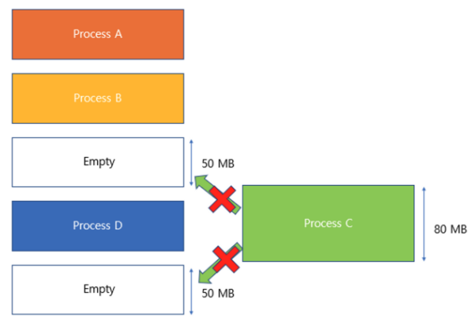
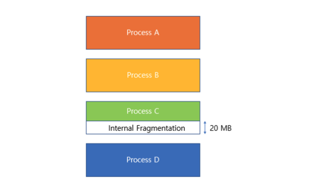

* toc
{:toc .large-only}
<!--more-->

## 메모리

### 메모리 관리 

프로그램이 잘 실행될 수 있도록 메모리를 할당하고 해제하는 작업이다. 컴퓨터의 메모리(RAM)은 공간이 제한적이기 때문에 여러 프로그램이 동시에 실행되기 위해서는 메모리 공간을 적절하게 분배하고 정리할 수 있어야 한다. 메모리를 제대로 관리하지 않을 경우, 프로그램이 서로의 데이터를 잘못 건드려서 프로그램이 멈추거나 오류가 발생할 수도 있고, 메모리가 부족하여 새로운 프로그램이 실행되지 못할 수도 있다.

즉, `메모리 공간의 할당`, `메모리 공간 해제`,`메모리의 보호`,`효율적인 메모리 관리` 등이 메모리 관리에 대한 핵심 기대효과라고 할 수 있다.

> **메모리 주소(Memory Address)**
>
> 메모리는 아주 많은 작은 공간으로 구성되어 있고, 각 공간에는 고유 번호가 있어 이 번호를 통해 데이터를 저장하거나 검색하게 되는데 이를 메모리 주소라고한다.

### 메모리의 핵심역할

#### 메모리 할당 (Allocation)

프로그램이 실행될 때 필요한 메모리 공간을 할당. 할당 된 공간은 다른 프로그램이 사용할 수 없고, 사용이 끝날 때 까지 보호된다. 

> **연속할당** : 메모리 공간을 연속적으로 제공하는 방식. 빠르고 관리가 쉽지만 제공할 수 있느 공간이 충분해야한다. **불연속할당** : 메모리 공간을 불규칙적으로 제공, 관리가 복잡하지만 공간을 효율적으로 사용할 수 있다. 

#### 메모리 해제 (Release)

프로그램이 끝나면 메모리 공간을 비운다. 메모리 해제가 제대로 되지 않으면 메모리 누수문제가 발생할 수 있다.

#### 메모리 보호 

프로그램끼리 서로의 메모리 공간을 침범하지 못하도록 보호한다.

#### 효율적인 메모리 관리

메모리 공간을 효율적으로 나눠서 최대한 많은 프로그램이 동시에 실행되도록 관리한다.

**고정분할방식**  미리 공간을 고정 된 길이로 나눠놓고 할당하는 방식. 외부단편화와 내부단편화가 발생할 수 있다. **가변분할방식**   메모리를 정해진 크기로 나누지 않고 프로그램이 요청하는 대로 자유롭게 크기를 바꿔가며 제공하는 방식. 내부단편화는 발생하지 않지만, 외부 단편화는 여전히 발생한다.

>**외부단편화** 남아있는 메모리의 크기가 실행하고자 하는 프로세스보다 크지만, 연속적이지 않은 공간에 존재하여 실행하지 못하는 상태 
>
>**내부단편화** 파티셔닝 상황에서 발생. 파티션의 크기가 프로세스의 크기보다 커서 메모리가 남지만 다른 프로세스가 사용할 수 없어진 상태 

### 가상메모리

실제 물리적 메모리(RAM) 크기보다 큰 공간을 프로그램이 사용할 수 있도록 컴퓨터가 만들어내는 가상의 메모리 공간.  

- 모든 프로세스가 고정된 주소를 가질 수 있도록 한다.
- 실제 물리적인 주소는 운영체제만 접근 할 수 있으므로 리소스를 보호할 수 있다.
- 보조 기억 장치 일부를 메모리처럼 사용할 수 있도록 한다.

#### 가상메모리의 원리

가상메모리는 실제메모리(RAM)과 보조기억장치(HDD,SSD)의 일부분을 활용해서 메모리를 관리한다.

- 논리주소(Logical address) - 프로세스가 사용
- 물리주소(Physical address) - 실제 컴퓨터의 RAM에서 사용 

이 두 주소 사이의 연결(매핑)을 운영체제가 관리하면서 프로세스가 실제 메모리 구조를 알지 못해도 실행이 가능하도록 한다

**`OS > 논리주소를 물리주소로 변환 > Page Table을 통해 관리`**

#### 가상메모리의 장점

1. 프로세스마다 독립된 주소 공간을 제공 모든 프로세스가 동일한 논리주소 범위(0~Max)를 사용할 수 있어서 프로그래밍이 용이해진다
2. 자원 보호 및 안정성 실제 물리 메모리의 접근은 운영체제만 가능하므로 프로세스가 타 프로세스의 영역을 침범할 수 없어 안전하다
3. 큰 프로그램도 실행 가능 실 제 메모리(RAM)크기보다 더 큰 프로그램의 실행이 가능해진다
4. 메모리 관리 효율 증가 자주 사용하지 않는 데이터를 보조기억장치로 보내서 실제 RAM의 효율을 높일 수 있다

#### 페이징

* **페이지(page)** 가상 주소와 물리적 주소를 매핑하는 단위로 일반적으로 4KB 또는 8KB의 크기. 메모리는 이 페이지 단위로 나뉘고 사용된다.
* **페이지 테이블(page table)** 가상 메모리의 페이지와 물리적 메모리의 페이지를 매핑해주는 표.

##### 방식1. 프로세스 스와핑

메모리 공간이 부족한 경우, 사용 빈도가 적은 프로세스를 잠시 하드디스크로 옮겨놓는 방법 프로세스D를 실행할 때 공간이 부족할 경우, 기존의 프로세스A,B,C 중 하나를 하드디스크로 이동한 후 공간을 확보한다 추후 다시 필요해질 경우, 하드디스크에 옮긴 프로세스를 다시 메모리로 불러서 사용

- 프로세스 단위로 스와핑하면 메모리 전체를 이동시키는 비용이 크다
- 많은 데이터를 하드디스크 <> 메모리로 전환하는 과정에서 속도가 느려지고 비효율적이다.

<u>위와 같은 단점으로 인해 최근엔 잘 사용하지 않고, 더 효율적인 단위인 페이지 단위 스와핑을 많이 사용한다</u>

##### 방식2. 요구 페이징

프로세스 전체가 아닌 `페이지 단위`로 필요한 부분만 하드디스크와 메모리에 옮기는 방식.

- 메모리 낭비를 줄일 수 있고, 효율적이다.

##### 페이징 기법의 문제점

페이징은 고정된 페이지 단위로 메모리를 나누기 때문에 남는공간이 생길 수 있다. 즉, 내부단편화가 발생할 수 있다. 이러한 문제점을 보완하기 위해 새롭게 추가되는 개념이 아래 서술할 세그멘테이션이다.

#### 세그멘테이션

세그멘테이션은 메모리를 `'역할'또는 '의미'단위`로 나누는 방법으로, 논리적으로 같은 역할을 하는 부분을 나눈다. `코드`, `데이터`, `힙`, `스택` 등의 용도에 따라 각각  나누어 따로 관리한다고 생각할 수 있다. 중요도에 따라 나눠서 저장할 수 있어 효율적이고, 같은 코드 영역은 하나만 저장해두고 같은 곳을 가리키도록 하는 방식이므로 중복되는 내용을 없앨 수 있다. 

##### 세그멘테이션의 문제점

세그먼트의 크기가 각각 다르기 때문에 메모리에 넣고 빼는 과정에서 중간중간 빈공간이 생길 수 있다. 즉, 외부단편화가 발생할 수 있다. 외부 단편화는 메모리의 공간을 크게 낭비할 수 도 있기 때문에 상당히 비효율적이다.

