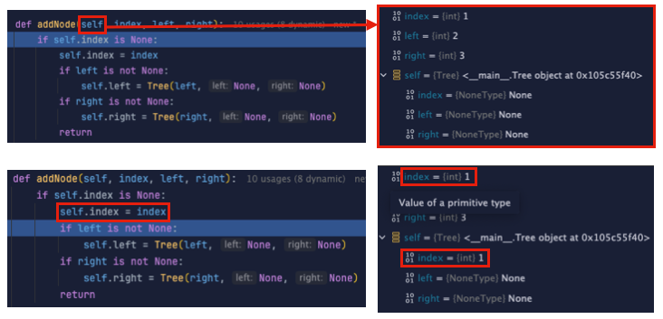
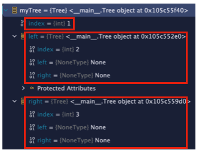
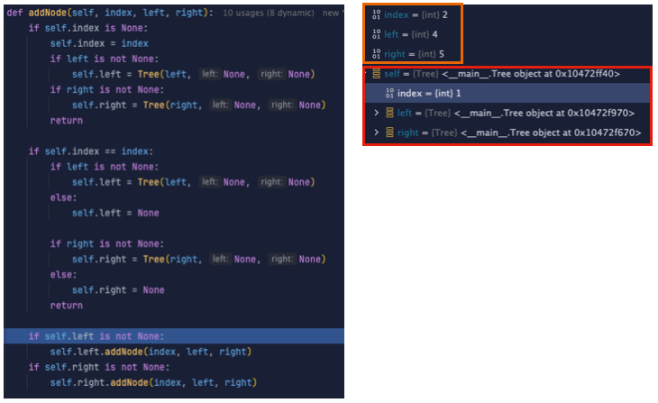
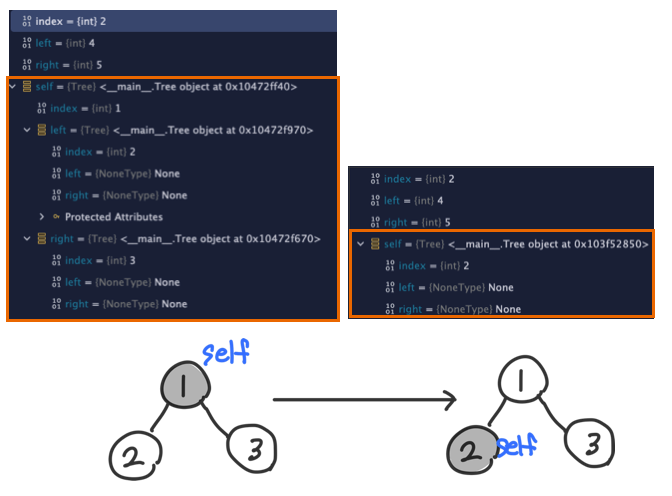
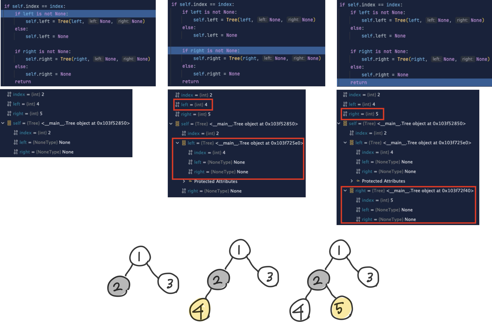
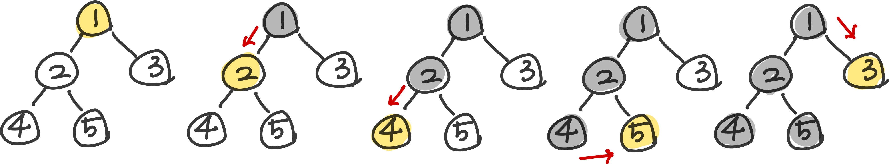
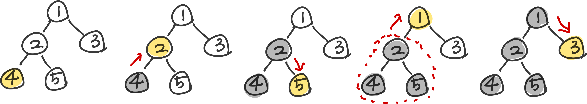
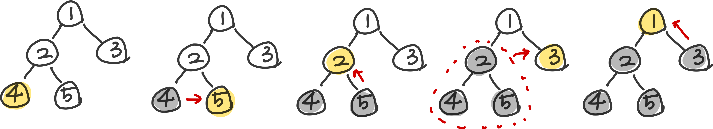
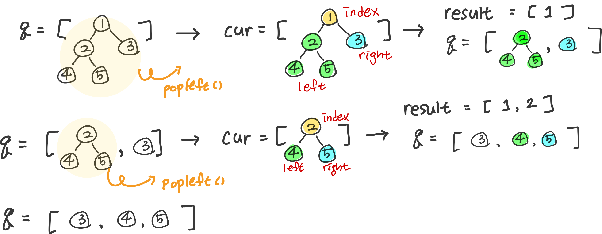
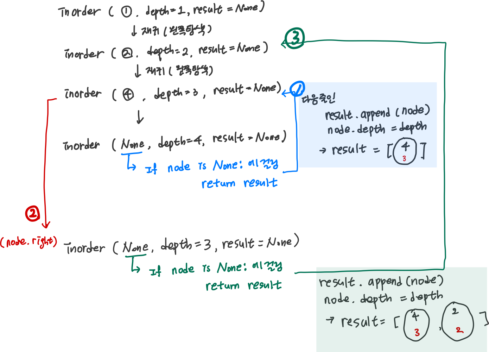

* toc
{:toc .large-only}
이어드림스쿨  자료구조 강의 중 트리에 관한 내용과 실습 코드들을 정리한 내용입니다.

트리 자료구조에 대한 다양한 실습을 수행하며, 각 구현에서 핵심이 되는 아이디어와 이를 기반으로 한 논리적 흐름을 정리하였습니다. 이를 통해 트리 구조에 대한 이론적 이해를 실제 코드 구현과 효과적으로 연결하고자 하였습니다.

<!--more-->

## 트리

### 노드 클래스 기반의 이진 트리 구현

```python
class Tree:
    def __init__(self, index, left, right): #트리 생성자
        self.index = index  #현재 노드의 고유의 값
        self.left = left    # 왼쪽 자식 노드 (Node객체 또는 None)
        self.right = right  # 오른쪽 자식 노드

    def addNode(self, index, left, right):
        if self.index is None:      # 루트 노드가 존재하지 않는다면
            self.index = index      # 현재 노드에 index값을 할당하여 루트 노드 생성
            if left is not None:    # 왼쪽 노드가 있다면
                self.left = Tree(left, None, None)  # 새로만든 노드의 왼쪽 노드에 받아온 left할당
            if right is not None:   # 오른쪽 노드가 있다면
                self.right = Tree(right, None, None)    # 새로만든 노드의 오른쪽 노드에 받아온 right 할당
            return

        if self.index == index:     # 현재 노드가 찾고자 하는 노드인 경우 == 노드의 자식을 새로 연결하는 경우
            if left is not None:
                self.left = Tree(left, None, None)
            else:
                self.left = None

            if right is not None:
                self.right = Tree(right, None, None)
            else:
                self.right = None
            return

        # index가 현재 노드가 아니라면 노드의 왼쪽과 오른쪽을 탐색하며 내려가면서 addNode (재귀탐색)
        if self.left is not None:
            self.left.addNode(index, left, right)
        if self.right is not None:
            self.right.addNode(index, left, right)
```

#### 해설 

```gherkin
(입력값)
5	# loop 회수
1 2 3	# value, left, rigth값
2 4 5
3 -1 -1	# -1인 경우 빈값
4 -1 -1
5 -1 -1
```

1. **노드 클래스 정의 및 생성자**

   `Tree`라는 이름의 클래스 정의. 이 클래스는 트리의 노드를 표현하는데 사용되고 생성자를 통해 초기화한다.<br>index에는 고유의 값(value)이 들어가며 left와 right은 같은 `Tree`객체 혹은 `None`이 할당 가능하다.

   ```python
   class Tree:
       def __init__(self, index, left, right):
           self.index = index 
           self.left = left   
           self.right = right  
   ```

2. **addNode() - 특정 자식에 노드를 추가하는 메서드 선언 및 구현**

   1. **노드가 비어있는 경우 == 루트 노드를 생성하는 경우**

      ```python
      def addNode(self, index, left, right):
          if self.index is None:     
              self.index = index    
              if left is not None:    
                  self.left = Tree(left, None, None)  
              if right is not None:   
                  self.right = Tree(right, None, None)
              return
      ```

      입력값 중 (`1 2 3`)이 들어온 시점 &rarr; Tree 객체에 아무 노드도 없기 때문에 `1 2 3`을 루트 노드로 만듬 

      

      왼쪽 캡쳐는 addNode 코드 / 오른쪽은 파란색으로 표시된 해당 줄에서의 각 변수에 할당 된 상태를 나타낸다.

      첫번째 그림에서 보면 self의 index, left, right이 모두 None이므로 `if self.index is None:`에 걸려서 `self.index = index`구문을 거치게 되고 두번째 그림에서 확인해보면 self객체의 index값이 None에서 1로 변한 것을 확인할 수 있다. 이와 같이 쭉 코드를 진행하면 

      

      새로만든 Tree 객체에 첫 노드로 Index = 1, left 에는 index가 2인 tree객체, right에는 index가 3인 tree객체가 할당된 것을 확인할 수 있다.

   2. **현재 노드가 자식 노드를 추가해야 할 대상인 경우**

      입력값의 첫번째 줄인 `1 2 3`이 끝난 후 `2 4 5`가 들어온 상황을 보면 아래와 같다. 

      

      self의 Tree 객체에는 아까 추가한 노드 (index=1, left = index가 2인 Tree, right=index가 3인 Tree)가 추가되어 있는 걸 확인할 수 있다. 즉 `self.index = 1`이고 현재 들어온 index에 할당 된 값은  `2` 이므로 첫번째 두번째 if문을 통과하고 마지막 분기를 타게된다. 

      현재 left에는 index가 2인 Tree가 들어있기 때문에 left객체에 새 노드를 이어붙이는 개념으로 `self.left.addNode(index, left, right)` 코드를 통해 현재 들어와 있던 index, left, right 값을 그대로 넘겨 **새 노드를 기준으로 다시 한번 함수를 실행하게 된다(재귀함수).** 코드와 디버그 화면으로 확인하면 다음과 같다. 

      

      

   3. **노드와 인덱스가 같은 경우 현재 노드가 찾고자 하는 노드인 경우 == 노드의 자식을 새로 연결하는 경우**

      위의 과정을 거치면 현재 들어와있는 `index` 와 `self.index`가 2로 동일한 걸 확인할 수 있다. 즉 중간에 있는 분기인 `if self.index == index:`를 타게된다. 이 과정에서 2의 하위 노드로 4와 5가 추가 되게 되고 입력 된 전체값들에 대해서 이 1,2,3 과정을 반복하면서 트리를 완성하게 된다.

      


### 트리 순회 구현

#### 해설

##### 전위순회

이 순회 방식은 트리 구조를 **직렬화하거나 복원할 때** 주로 활용되며, 수식을 트리로 표현한 경우 **전위 표기법 (prefix notation)** 을 만들 때도 사용된다.

```python
def preorder(tree) :
    result = []
    
    result.append(tree.index)
    if tree.left != None :
        result = result + preorder(tree.left)
    if tree.right != None :
        result = result + preorder(tree.right)

    return result
```

동작 흐름:

1. `result.append(tree.index)` → **현재 들어온 트리** 노드의 인덱스를 먼저 저장한다. (즉 루트 방문)
2. `if tree.left != None:` → **왼쪽 자식 노드가 있다면 재귀 호출하여 끝까지** 내려간다.
3. `if tree.right != None:` → 왼쪽 서브트리를 다 돈 뒤, **오른쪽 서브트리를 재귀 호출**한다.

##### 중위순회

이 방식은 이진 탐색 트리(BST)에서 **오름차순 정렬된 값을 출력**할 때 자주 쓰인다.

```python
def inorder(tree) :
    result = []
    
    if tree.left != None :
        result = result + inorder(tree.left)
    result.append(tree.index)
    if tree.right != None :
        result = result + inorder(tree.right)

    return result
```

동작 흐름:

1. `if tree.left != None:` → 왼쪽 자식이 있다면 **끝까지 들어간다.**
2. `result.append(tree.index)` → **왼쪽이 끝났다면 현재 노드를 저장**한다.
3. `if tree.right != None:` → **마지막으로 오른쪽** 서브트리로 재귀 순회를 한다

##### 후위순회

트리 기반의 구조를 **삭제할 때** 유용하며, **하위 구조부터 정리**하는 느낌으로 생각하면 이해가 쉽다.

```python
def postorder(tree) :
    result = []

    if tree.left != None :
        result = result + postorder(tree.left)
    if tree.right != None :
        result = result + postorder(tree.right)
    result.append(tree.index)

    return result
```

동작 흐름:

1. `if tree.left != None:` → 왼쪽 자식이 있다면 **끝까지 탐색.**
2. `if tree.right != None:` → 그 후 **오른쪽 자식으로 이동해 탐색**.
3. `result.append(tree.index)` → 자식 노드들이 **모두 끝나고 나서야 현재 노드를 저장**한다.

### <span style="color:red">이진트리순회 - BFS</span>

```python
from collections import deque

def BFS(tree):
    q = deque()
    q.append(tree)
    
    result = []

    while q:
        cur = q.popleft()
        if cur is None:
            continue
        result.append(cur.index)	# 인덱스만 뽑아서 result에 저장

        q.append(cur.left)	# left와 right은 queue에 저장 (선입선출 구조 활용)
        q.append(cur.right)

    return result
```

#### 해설

**입력값**

```gherkin
(입력값)
5	# loop 회수
1 2 3	# value, left, rigth값
2 4 5
3 -1 -1	# -1인 경우 빈값
4 -1 -1
5 -1 -1
```



**동작 흐름**

1. `q.append(tree)` → 루트 노드를 큐에 넣고, **탐색을 시작**한다.
2. `cur = q.popleft()` → 큐에서 노드를 하나 꺼내 현재 노드로 설정한다.
3. `if cur is None:` → 현재 노드가 `None`이면 **리프노드의 자식이므로 건너뛴다**.
4. `result.append(cur.index)` → 현재 노드를 방문한 것으로 간주하고 **값을 저장**한다.
5. `q.append(cur.left)` → 현재 노드의 **왼쪽 자식을 큐에 추가**한다.
6. `q.append(cur.right)` → 그 다음 **오른쪽 자식을 큐에 추가**한다.
7. `while q:` → 큐가 비어 있을 때까지 **위 과정을 반복**한다.

### 트리의 높이

```python
def getHeight(myTree) :
    if myTree == None :
        return 0
    else :
        return 1 + max(getHeight(myTree.left), getHeight(myTree.right))
```

### 트리의 너비

```python
def inorder(node, depth, result=None):
    if result is None:
        result = []

    if node is None:
        return result

    inorder(node.left, depth + 1, result)  # 왼쪽 서브트리 탐색
    result.append(node)  # 현재 노드 저장
    node.depth = depth  # 노드에 깊이 정보 추가
    inorder(node.right, depth + 1, result)  # 오른쪽 서브트리 탐색

    return result

# 중위 순회를 통해 노드의 위치를 '열번호'처럼 간주
# 각 깊이별로 가장 왼쪽, 오른쪽에 있는 노드의 인덱스를 기록
# 너비 = (오른쪽 인덱스 - 왼쪽 인덱스 + 1)로 계산
# 가장 너비가 큰 레벨을 찾아 반환

def getWidth(myTree):
    result = inorder(myTree, 1)
    n = len(result)

    left = [1001] * 1000
    right = [-1] * 1000
    maxDepth = 0

    for i in range(n):          # 중위 순회의 인덱스(i)가 트리 상의 `열번호` 역할을 함.
        d = result[i].depth     # 해당 노드가 위치한 깊이

        left[d] = min(left[d], i)   # 각 깊이에서 가장 왼쪽에 등장한 인덱스와, 가장 오른쪽에 등장한 인덱스 갱신
        right[d] = max(right[d], i)
        maxDepth = max(maxDepth, d) # 동시에 최대 깊이도 갱신

    ansDepth = 0        # 너비가 가장 큰 레벨
    ansWidth = 0        # 그 레벨의 너비 값

    for i in range(1, maxDepth + 1):
        temp = right[i] - left[i] + 1

        if ansWidth < temp:
            ansDepth = i
            ansWidth = temp

    return (ansDepth, ansWidth)
```

#### 해설 

1. **트리를 중위순회로 정렬** 

   통상적인 트리의 너비 (각 레벨의 노드의 개수) 를 구하는 경우에는 BFS 방식을 활용하나, 현재 실습에 주어진 문제는 **열 위치**를 기준으로 너비를 계산해야한다. 

   <u>즉 <mark>왼쪽 &rarr; 오른쪽</mark> 으로 순서를 탐색하며 각 노드와 열의 위치를 한번에 저장해주는 작업이 선행되어야 한다.</u>

   ```python
   def inorder(node, depth, result=None):
       if result is None:
           result = []
   
       if node is None:
           return result
   
       inorder(node.left, depth + 1, result)  # 왼쪽 서브트리 탐색
       result.append(node)  # 현재 노드 저장
       node.depth = depth  # 노드에 깊이 정보 추가
       inorder(node.right, depth + 1, result)  # 오른쪽 서브트리 탐색
   
       return result
   ```

   

​	위 그림 처럼 재귀함수를 돌면서 중위순회로 읽은 node리스트와 각 depth를 함께 저장한 result를 반환하게 됨

2. **각 깊이 별로 가장왼쪽노드 / 가장오른쪽노드를 탐색하며 너비를 구함**

   ```python
   def getWidth(myTree):
       result = inorder(myTree, 1)
       n = len(result)
   
       left = [1001] * 1000
       right = [-1] * 1000
       maxDepth = 0
   
       for i in range(n):          # 중위 순회의 인덱스(i)가 트리 상의 `열번호` 역할을 함.
           d = result[i].depth     # 해당 노드가 위치한 깊이
   
           left[d] = min(left[d], i)   # 각 깊이에서 가장 왼쪽에 등장한 인덱스와, 가장 오른쪽에 등장한 인덱스 갱신
           right[d] = max(right[d], i)
           maxDepth = max(maxDepth, d) # 동시에 최대 깊이도 갱신
   
       ansDepth = 0        # 너비가 가장 큰 레벨
       ansWidth = 0        # 그 레벨의 너비 값
   
       for i in range(1, maxDepth + 1):
           temp = right[i] - left[i] + 1
   
           if ansWidth < temp:
               ansDepth = i
               ansWidth = temp
   
       return (ansDepth, ansWidth)
   ```

   ### **동작 흐름**

   1. `result = inorder(myTree, 1)`
       → 중위 순회를 통해 트리의 노드를 방문하면서, 각 노드의 깊이 정보를 포함한 리스트를 생성한다.

   2. `n = len(result)`
       → 중위 순회 결과의 길이를 저장한다. (전체 노드 수)

   3. `left = [1001] * 1000`, `right = [-1] * 1000`
       → 각 깊이에서 등장하는 **가장 왼쪽 인덱스**와 **가장 오른쪽 인덱스**를 기록할 배열을 초기화한다.
       (인덱스는 중위 순회 순서를 기준으로 한 위치)

   4. `for i in range(n):`
       → 중위 순회 결과를 순회하며 각 노드에 대해 다음을 수행한다.

      4-1. `d = result[i].depth`
       → 현재 노드의 깊이를 가져온다.

      4-2. `left[d] = min(left[d], i)`
       → 해당 깊이에서 가장 왼쪽 인덱스를 갱신한다.

      4-3. `right[d] = max(right[d], i)`
       → 해당 깊이에서 가장 오른쪽 인덱스를 갱신한다.

      4-4. `maxDepth = max(maxDepth, d)`
       → 전체 트리에서의 최대 깊이를 갱신한다.

   5. `ansDepth = 0`, `ansWidth = 0`
       → 너비가 가장 큰 레벨과 그 너비를 저장할 변수를 초기화한다.

   6. `for i in range(1, maxDepth + 1):`
       → 각 깊이에 대해 너비를 계산하고 비교한다.

      6-1. `temp = right[i] - left[i] + 1`
       → 해당 깊이에서의 너비를 계산한다.
       (중위 순회 인덱스 기반으로 왼쪽~오른쪽 거리)

      6-2. `if ansWidth < temp:`
       → 지금까지의 최대 너비보다 크다면 다음을 수행한다.

      6-3. `ansDepth = i`, `ansWidth = temp`
       → 현재 깊이와 너비로 갱신한다.

   7. `return (ansDepth, ansWidth)`
       → 가장 너비가 큰 레벨과 해당 너비를 반환한다.
