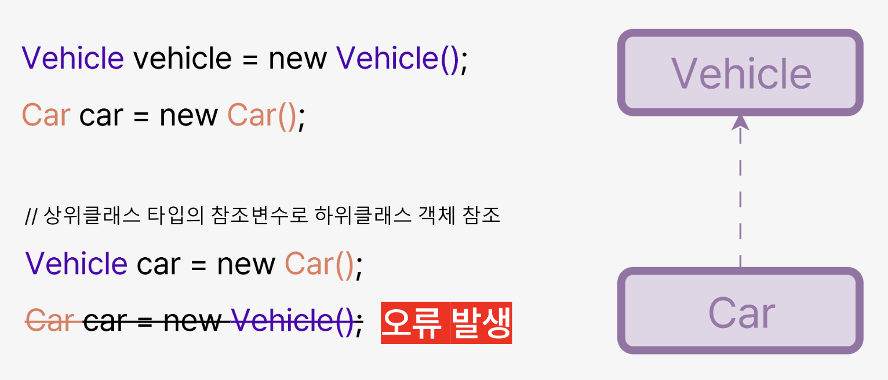
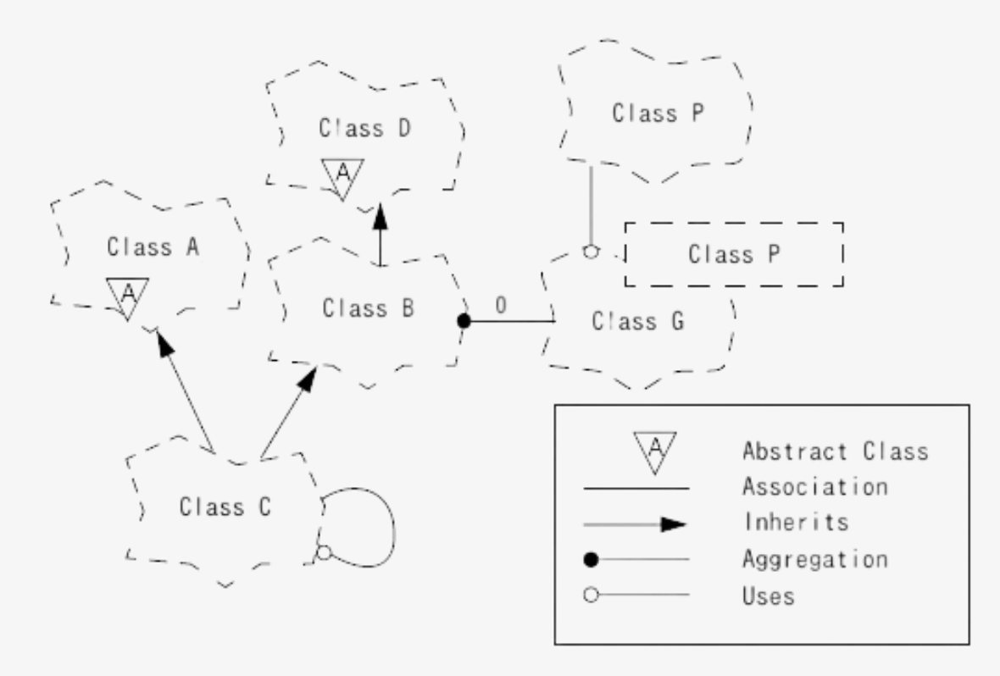
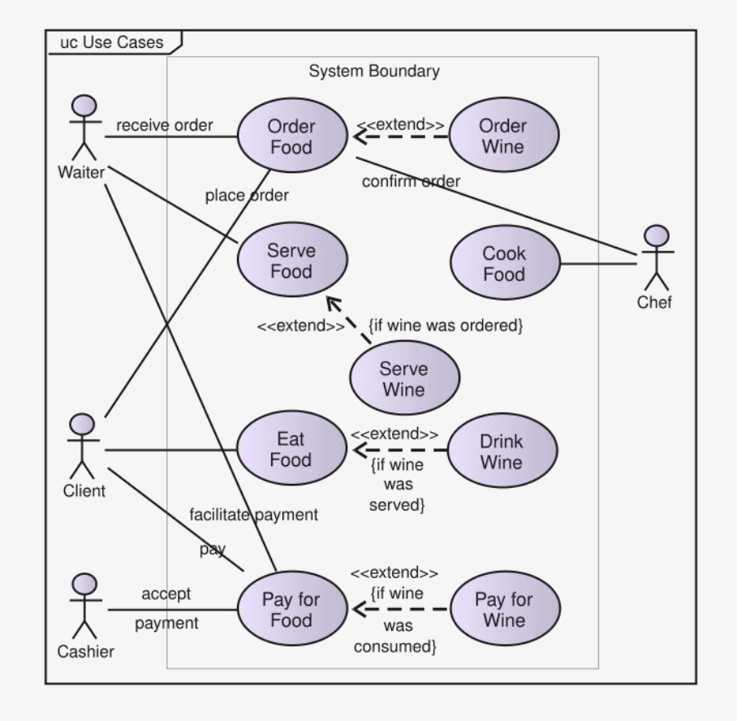
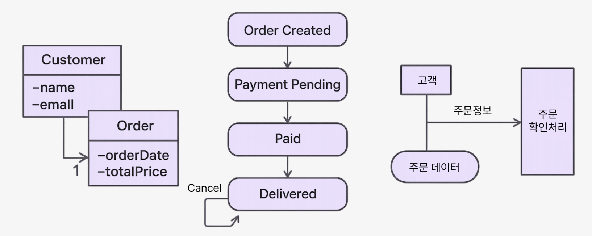
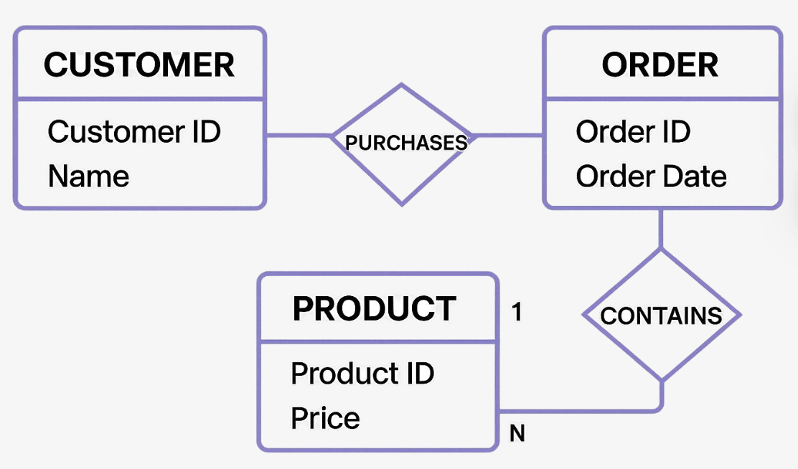
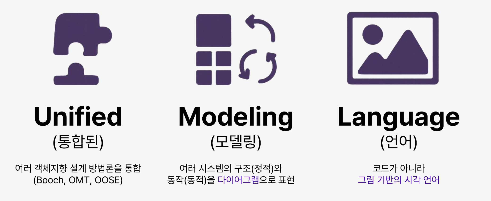
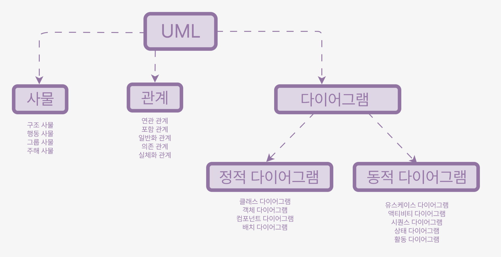
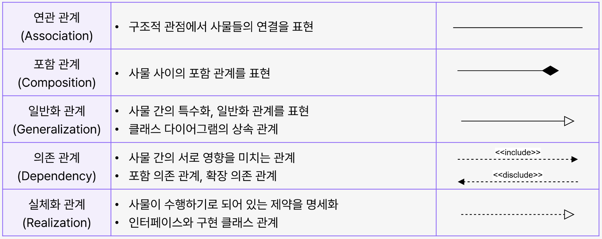

* toc
{:toc .large-only}
이어드림스쿨 CS지식심화 강의를 통해 배운 디자인패턴 관련 내용을 정리한 글입니다. 

<!--more-->

## 객체지향 프로그래밍

**Object-Oriented Programming**

프로그램을 설계할 때 `객체`단위로 파악하고, 이들 간의 상호작용을 통해 기능을 구현하는 프로그래밍 패러다임

* **객체** - 사람과 동물, 무생물, 논리, 사상 개념 등 모든 '실재하는 것'
* **객체의 3가지 특징**
  * 상태 - 객체가 지니는 데이터 값 (시간에 따라 변할 수 있음)
  * 행동 - 객체가 수행할 수 있는 기능 또는 동작
  * 정체성 - 각 객체는 다른 객체와 구별됨

- **객체의 3가지 요소**
  - 속성 - 객체의 상태를 나타내는 값
  - 메서드 - 객체가 수행할 수 있는 동작
  - 메세지 - 각 객체들끼리 정보를 주고받는 수단

## 객체지향 프로그래밍의 특징

### 추상화(Abstraction)

구현의 세부사항은 숨기고, 사용자에게는 기능만 보여주는 과정이다. 

복잡한 현실을 단순하게 모델링하는 기법으로 불필요한 정보는 감추고 필요한 정보만 제공한다. <br>기능 추상화, 제어 추상화, 자료 추상화 등의 기법이 있다.

**<mark>추상화의 일반적인 예시</mark>**

```python
# 함수 추상화

def calculate_sum(number_list):
  current_sum = 0

  for number in number_list:
    current_sum += number

  return current_sum

my_numbers = [10, 20, 30, 40, 50]
another_list = [1, 2, 3]

print(f"숫자 리스트 1: {my_numbers}")

# calculate_sum 함수 호출 (내부 로직은 숨겨져 있음)
total1 = calculate_sum(my_numbers)
print(f"리스트 1의 합계: {total1}") # 출력: 리스트 1의 합계: 150

# 파이썬 내장 함수 sum()과 비교
# 사실 파이썬에는 이미 합계를 구해주는 sum() 함수가 내장되어 있습니다.
# 우리가 sum()을 쓸 때 내부 구현을 모르듯이, 우리가 만든 calculate_sum도
# 사용하는 입장에서는 내부 구현을 몰라도 되는 '추상화'된 함수입니다.
print(f"\n내장 함수 sum() 사용 결과: {sum(my_numbers)}")
```

위 코드에서 함수 `calculate_sum`을 사용하는 과정을 살펴보자.

함수를 사용하는 사람은 함수의 이름과 인자만 알면 해당 함수를 사용하여 원하는 결과를 받아볼 수 있다. 함수 안에 반복문이 어떻게 돌려지고, 변수를 어떻게 사용하는지 신경쓰지 않아도 '합계 계산'이라는 기능을 사용할 수 있는 것이다. 

이렇듯 사용하는 입장에서 내부 구현을 몰라도 되는 함수를 `추상화` 된 함수라고 한다. 

### 캡슐화(Encapsulation)

데이터와 해당 데이터를 처리하는 메서드를 하나로 묶어서 외부에서의 접근을 제한하는 것을 일컫는다.<br>캡슐화를 통해 데이터의 직접적인 변경을 방지하거나 제한할 수 있다. <u>즉, 속성과 기능을 하나로 묶고 외부에 꼭 필요한 기능만 노출하고 나머지는 모두 내부로 숨기는 행위이다.</u>

> 객체 지향에서는 어떤 것을 숨기고 어떤 것을 노출해야 할까?
>
> 1. 데이터를 숨겨야한다.<br>캡슐화에서 가장 필수적으로 숨겨야하는 것은 속성(데이터)이다. 객체 내부의 데이터를 외부에서 함부로 접근하게 두면 클래스 안에서 데이터를 다루는 모든 로직을 무시하고 데이터를 변경할 수 있게 되므로 캡슐화가 깨지기 때문이다. <u>즉, 객체의 데이터는 반드시 객체가 제공하는 메서드를 통해서 접근해야한다.</u>
> 2. 기능을 숨겨야한다.<br>객체의 기능 중 외부에서는 사용하지 않고 내부에서만 사용하는 기능들은 모두 감추는 게 좋다. 사용자의 입장에서 꼭 필요한 기능만 외부로 노출하고 나머지 기능은 모두 내부로 숨겨야한다.

**<mark>캡슐화가 안된 경우</mark>**

```python
class BadCar:
    def __init__(self):
        self.speed = 0 # 외부에서 직접 접근 가능

car = BadCar()

# 외부에서 직접 속도 변경
car.speed = 5000  # 말도 안 되는 속도 값 할당!
car.speed = -100 # 음수 속도 값 할당!
```

**<mark>캡슐화가 된 경우</mark>**

```python
class GoodCar:
    def __init__(self):
        self._speed = 0 # '_'로 시작하여 내부용임을 표시

    ## @property 데코레이터: 아래 정의된 speed(self) 메서드를
    # 외부에서 car.speed 처럼 속성(변수)처럼 접근할 수 있게 해줍니다. (Getter 역할)
    @property
    def speed(self):
        return self._speed

    # @speed.setter 데코레이터: speed 속성에 값을 할당하려고 할 때 (예: car.speed = 100)
    # 아래 정의된 speed(self, value) 메서드가 대신 호출되게 합니다. (Setter 역할)
    @speed.setter
    def speed(self, value):
        if 0 <= value <= 250: # 유효성 검사!
            self._speed = value
            print(f"속도가 {value} km/h 로 설정되었습니다.")
        else:
            print(f"오류: 속도는 0에서 250 사이여야 합니다. 입력값: {value}")

car = GoodCar()
car.speed = 100 # Setter 호출 -> 유효성 검사 통과 -> 값 변경
car.speed = 300 # Setter 호출 -> 유효성 검사 실패 -> 값 변경 안 됨
# car._speed = 5000 # 이렇게 직접 접근하는 것은 관례적으로 피해야 함!
```

### 상속(Inheritance)

기존에 잘 만든 클래스를 기반으로 새로운 클래스를 만드는 방법. 즉 기존 클래스의 필드와 메서드를 새로운 클래스에서 재사용하게 해준다. 이름 그대로 기존 클래스의 속성과 기능을 그대로 물려받는 것이다. 

```python
# 부모 클래스 (Base Class, 상위 클래스) - Vehicle
class Vehicle:
    """
    차량의 공통 속성(브랜드)과 기능(설명)을 정의하는 부모 클래스
    """
    def __init__(self, brand):
        # 속성: 브랜드
        # 파이썬에서는 관례적으로 '_'를 붙여 내부/상속용임을 나타냄
        self._brand = brand
        # print(f"Vehicle 생성자: 브랜드 '{self._brand}' 설정") # 확인용 출력

    def describe(self):
        """
        차량 정보를 설명하는 메서드 (자식 클래스에서 재정의될 수 있음)
        """
        return f"This is a vehicle of brand: {self._brand}"

# 자식 클래스 (Derived Class, 하위 클래스) - Car
# Vehicle 클래스를 상속받음 (괄호 안에 부모 클래스 명시)
class Car(Vehicle):
    """
    Vehicle 클래스를 상속받아 Car 고유의 속성(문 개수)과
    재정의된 기능(설명)을 추가한 자식 클래스
    """
    def __init__(self, brand, doors):
        # 부모 클래스(Vehicle)의 생성자를 호출하여 brand 속성 초기화
        super().__init__(brand)

        # 자식 클래스(Car) 고유의 속성: 문 개수
        self._doors = doors
        # print(f"Car 생성자: 문 개수 '{self._doors}' 설정") # 확인용 출력

    # 부모 클래스의 describe 메서드를 재정의 (오버라이딩, Overriding)
    def describe(self):
        """
        Car에 맞게 차량 정보를 구체적으로 설명하도록 부모 메서드를 재정의
        """
        # 부모로부터 상속받은 _brand 속성과 자신만의 _doors 속성을 함께 사용
        return f"This is a car of brand: {self._brand} with {self._doors} doors."

# --- 코드 사용 예시 ---

# 1. 부모 클래스(Vehicle)의 인스턴스 생성 및 사용
print("--- 부모 객체 테스트 ---")
generic_vehicle = Vehicle("Generic Motors")
print(generic_vehicle.describe())
# 출력: This is a vehicle of brand: Generic Motors

# 2. 자식 클래스(Car)의 인스턴스 생성 및 사용
print("\n--- 자식 객체 테스트 ---")
my_car = Car("Hyundai", 4)
print(my_car.describe())  # Car 클래스에서 재정의된 describe 메서드가 호출됨
# 출력: This is a car of brand: Hyundai with 4 doors.

# 3. 상속 확인: Car 객체는 Vehicle의 인스턴스이기도 함 (is-a 관계)
print(f"\nmy_car는 Car의 인스턴스인가? {isinstance(my_car, Car)}")       # True
print(f"my_car는 Vehicle의 인스턴스인가? {isinstance(my_car, Vehicle)}") # True
```

### 다형성(Polymorphism)

하나의 동작을 여러 방식으로 수행할 수 있는 능력으로 동일한 메시지(메서드 호출)에 대해 객체별로 다르게 반응한다. <br>두 클래스가 상속 관계를 맺고 있다면, 부모 타입으로 자식객체를 문제 없이 사용할 수 있다. <u>즉, 부모 클래스를 자식 클래스처럼 활용할 수 있다는 의미</u>이다.



```python
# ==================================================
# 클래스 정의 (상속 예제 + start_engine 추가)
# ==================================================

# 부모 클래스 (Base Class, 상위 클래스) - Vehicle
class Vehicle:
    def __init__(self, brand):
        self._brand = brand

    def describe(self):
        # 기본 설명 메서드
        return f"This is a vehicle of brand: {self._brand}"

    def start_engine(self):
        # 기본 엔진 시동 메서드
        return f"{self._brand} vehicle engine starts. (Vehicle base method)"

# 자식 클래스 (Derived Class, 하위 클래스) - Car
class Car(Vehicle):
    def __init__(self, brand, doors):
        super().__init__(brand)
        self._doors = doors

    # 메서드 오버라이딩 (describe)
    def describe(self):
        # Car에 특화된 설명
        return f"This is a car of brand: {self._brand} with {self._doors} doors."

    # 메서드 오버라이딩 (start_engine)
    def start_engine(self):
        # Car에 특화된 엔진 시동 메서드
        return f"{self._brand} car engine starts smoothly! (Car override method)"

# ==================================================
# 다형성(Polymorphism) 사용 예시
# ==================================================

print("--- 다형성 예시 1: 부모 타입 변수로 자식 객체 참조 ---")

# 변수 my_vehicle의 타입 힌트는 Vehicle이지만, 실제 할당된 객체는 Car입니다.
# Java의 Vehicle myVehicle = new Car("Kia", 4); 와 유사한 상황
my_vehicle: Vehicle = Car("Kia", 4)

# 1. describe() 메서드 호출
# 변수 타입(Vehicle)이 아닌 실제 객체(Car)의 메서드가 호출됩니다.
description = my_vehicle.describe()
print(f"결과 (describe): {description}")
# 출력: 결과 (describe): This is a car of brand: Kia with 4 doors.

# 2. start_engine() 메서드 호출
# 마찬가지로 실제 객체(Car)의 오버라이딩된 start_engine() 메서드가 호출됩니다.
engine_start_msg = my_vehicle.start_engine()
print(f"결과 (start_engine): {engine_start_msg}")
# 출력: 결과 (start_engine): Kia car engine starts smoothly! (Car override method)

print("\n--- 다형성 예시 2: 다양한 타입의 객체를 동일하게 처리 ---")

# 리스트에 여러 종류의 Vehicle 객체 (Vehicle 인스턴스, Car 인스턴스)를 담습니다.
vehicles_list = [
    Vehicle("Generic"),
    Car("Hyundai", 4),
    Vehicle("TruckBrand"),
    Car("BMW", 2)
]

# 반복문을 통해 리스트의 모든 객체를 'Vehicle'로서 동일하게 다룹니다.
for v in vehicles_list:
    # v 변수는 반복마다 다른 실제 객체(Vehicle 또는 Car)를 참조하게 됩니다.
    # 하지만 우리는 동일하게 .describe() 와 .start_engine() 메서드를 호출할 수 있습니다.
    print("--------------------")
    print(f"객체 타입: {type(v).__name__}")
    # 실제 객체의 타입에 맞는 describe() 메서드가 알아서 호출됩니다.
    print(f"설명: {v.describe()}")
    # 실제 객체의 타입에 맞는 start_engine() 메서드가 알아서 호출됩니다.
    print(f"엔진: {v.start_engine()}")

# 출력 예시:
# --------------------
# 객체 타입: Vehicle
# 설명: This is a vehicle of brand: Generic
# 엔진: Generic vehicle engine starts. (Vehicle base method)
# --------------------
# 객체 타입: Car
# 설명: This is a car of brand: Hyundai with 4 doors.
# 엔진: Hyundai car engine starts smoothly! (Car override method)
# --------------------
# 객체 타입: Vehicle
# 설명: This is a vehicle of brand: TruckBrand
# 엔진: TruckBrand vehicle engine starts. (Vehicle base method)
# --------------------
# 객체 타입: Car
# 설명: This is a car of brand: BMW with 2 doors.
# 엔진: BMW car engine starts smoothly! (Car override method)
```

```python
# 자식 타입 변수에 부모 객체를 할당했을 때 발생하는 문제 상황
# ==================================================
# 클래스 정의 (이전 코드와 동일 - 여기서는 생략 가능)
# ==================================================
class Vehicle:
    def __init__(self, brand):
        self._brand = brand

    def describe(self):
        return f"This is a vehicle of brand: {self._brand}"

    def start_engine(self):
        return f"{self._brand} vehicle engine starts. (Vehicle base method)"

class Car(Vehicle):
    def __init__(self, brand, doors):
        super().__init__(brand)
        self._doors = doors

    def describe(self):
        return f"This is a car of brand: {self._brand} with {self._doors} doors."

    def start_engine(self):
        return f"{self._brand} car engine starts smoothly! (Car override method)"

# ==================================================
# 오류 발생 예시 (Java의 Car car = new Vehicle(); 에 해당)
# ==================================================

print("--- 오류 예시: 자식 타입 변수에 부모 객체 할당 시도 ---")

try:
    # 1. 변수 선언 및 할당:
    # Car 타입으로 힌트(기대)했지만, 실제로는 Vehicle 객체를 할당.
    # Python에서는 이 할당 자체는 오류 없이 실행될 수 있음.
    maybe_a_car: Car = Vehicle("Some Generic Brand")
    print(f"객체 타입: {type(maybe_a_car).__name__}") # 출력: 객체 타입: Vehicle

    # 2. 부모/자식 공통 메서드 호출:
    # describe() 메서드는 부모인 Vehicle에도 있으므로 호출 가능.
    # 이 때는 Vehicle의 describe()가 실행됨.
    print(f"설명 호출: {maybe_a_car.describe()}") # 출력: 설명 호출: This is a vehicle of brand: Some Generic Brand

    # 3. 자식 클래스 고유 멤버 접근 시도 (오류 발생 지점!):
    # _doors 속성은 Car 클래스에만 있고 Vehicle 클래스에는 없음.
    # 따라서 Vehicle 객체인 maybe_a_car에서 _doors를 찾으려 하면 오류 발생!
    print("이제 Car 클래스 고유의 _doors 속성에 접근합니다...")
    print(f"문 개수: {maybe_a_car._doors}") # 이 줄에서 AttributeError 발생 예상!

except AttributeError as e:
    # 4. 오류 처리:
    # try 블록 안에서 AttributeError가 발생하면 이 부분이 실행됨.
    print(f"\n!!! 예상대로 오류가 발생했습니다 !!!")
    print(f"오류 종류: {type(e).__name__}")
    print(f"오류 내용: {e}")
    print("\n이유: 'maybe_a_car' 변수가 실제로는 Vehicle 객체를 담고 있는데,")
    print("     Vehicle 객체에는 Car 클래스 고유의 속성인 '_doors'가 없기 때문입니다.")
    print("결론: 자식 클래스 타입(Car)의 변수에 부모 클래스 객체(Vehicle)를 넣고")
    print("      자식 클래스 고유의 기능을 사용하려고 하면 문제가 발생합니다.")
    print("      (Java에서는 이런 할당 자체가 컴파일 오류입니다)")
```

> **함수/메서드의 오버로딩과 오버라이딩**
>
> java와는 다르게 파이썬에서는 해당 기능을 직접 제공하고 있지 않다.
>
> - 오버로딩 - 한 클래스 내에서 같은 이름의 메서드를 사용하는 것 
> - 오버라이딩 - 상속 관계의 두 클래스의 상위 클래스에서 정의한 메서드를 하위클래스에서 재정의하여 사용하는 것
>
> ```python
> # (참고) Python에서 오버로딩과 유사한 효과를 내는 방법
> 
> # 예시: 기본값 인수를 사용한 유사 오버로딩
> def add_flexible(x, y, z=0): # z의 기본값을 0으로 설정
>   print(f"add_flexible 호출됨: x={x}, y={y}, z={z}")
>   return x + y + z
> 
> print("\n--- 유연한 함수 예시 ---")
> print(f"인자 두 개 호출: {add_flexible(10, 20)}")      # z는 기본값 0 사용
> print(f"인자 세 개 호출: {add_flexible(10, 20, 30)}") # z에 30 전달
> ```

## 객체지향 설계 원칙 


### 단일 책임 원칙 (Single Responsiblilty Principle)

- 하나의 클래스는 단 하나의 책임만 가져야 한다.
- 변경 사유는 하나여야 한다. (하나의 클래스가 여러 이유로 바뀐다면 SRP 위반)

### 개방-폐쇄 원칙 (Open/Closed Principle)

- 확장에는 열려 있고, 수정에는 닫혀 있어야 한다.
- 기능을 변경할 땐 기존 코드를 건드리지 않고, 새 클래스를 통해 확장한다.
- 인터페이스, 추상 클래스 적극 활용

### 리스코프 치환원칙 (Liskov Substitution Principle)

`상속`과 관련된 원칙

- 하위 타입은 상위 타입을 대체할 수 있어야한다.
- 자식 클래스가 부모 클래스의 기능을 변경하거나 깨뜨리지 않고, 부모처럼 동작해야한다는 의미

### 인터페이스 분리 원칙 (Interface Segregation Principle)

- 큰 인터페이스를 여러 개의 작은 인터페이스로 분리
- 클라이언트는 자신이 사용하지 않는 인터페이스에 의존해서는 안됨

### 의존 역전 원칙 (Dependency Inversion Principle)

- 상위 모듈이 하위 모듈에 의존하지 않아야 한다. 
- 상위 모듈과 하위 모듈 둘 다 추상화(인터페이스)에 의존해야 한다.
- 의존성 주입 (Dependency  Injection)에 활용한다.

## 객체지향 개발 방법론

분석 &rarr; 설계 &rarr; 구현 단계를 객체 중심으로 연결 

전통적인 절차적 방법론과 차별화됨

#### Booch 



>  다양한 다이어그램을 통해 시스템의 구조와 동작을 시각화하는 방법론

- 클래스를 구름모양으로 표현하는 독특한 시각적 스타일
- 클래스와 객체의 식별자, 속성, 메서드를 구체적으로 표기한다.
- 관계 (연관,상속,포함 등)은 화살표와 선 스타일로 구분한다.
- 복잡한 시스템 구조를 세분화하여 쉽게 표현할 수 있도록 설계한다.

#### OOSE



> 유스케이스(Use Case) 개념을 처음 도입한 방법론

- 시스템이 사용자와 어떻게 상호작용(Use Case)하는지를 시나리오로 기술
- 요구사항 수집의 도구로 사용됨 

#### OMT



> 개발 과정을 세 가지 모델로 나누어 체계적으로 접근

- James Rumbaugh가 개발한 객체지향 분석 및 설계 방법론

- 시스템을 객체 중심으로 분석, 설계, 구현까지 체계적으로 진행
- 구조(what). 동작(how), 기능(why)을 구분하여 각각 모델링

#### Coad&Yourdon



> E-R 다이어그램으로 객체의 행위를 모델링하는데 초점을 둔 방법

- 현실 세계의 데이터를 개체(Entity), 속성(Attribute), 관계(RelationShip)로 표현
- 객체지향 분석과 설계에 대한 이해가 높은 설계자에게 적합한 기법

## UML 다이어그램

UML - 소프트웨어 시스템을 시각적으로 모델링(설계)하기 위한 표준화된 언어





#### 사물

- 구조사물 - 시스템을 구성하는 요소(클래스, 인터페이스)

- 행동사물 - 시스템의 동작 (메시지, 상호작용)

- 그룹사물 - 요소들을 묶어주는 역할 (패키지)

- 주해사물 - 부가적인 정보 (메모, 설명 등)

#### 관계



#### 다이어그램

사물들 간의 관계를 도형으로 표현한 것. 시스템을 다양한 관점에서 시각화하기 위해 사용하는 표현 도구.

소프트웨어 구조 동작, 관계등을 그림으로 보여주는 설계 문서 

##### 정적 다이어그램

1. 클래스 다이어그램<br>시스템을 구성하는 클래스, 속성, 메서드 등을 표현하고 클래스간의 관계를 시각적으로 표현한다.
2. 컴포넌트 다이어그램<br>실제 구현 모듈인 컴포넌트 간의 관계를 표현하는 다이어그램
3. 객체 다이어그램<br>클래스 다이어그램의 실제 객체들 간의 관계를 표현. 시스템의 특정 시점에서의 구조를 나타냄.
4. 배치 다이어그램<br>노드와 노드 사이에 존재하는 컴포넌트 들의 물리적 구성을 표현<br>* 노드는 하드웨어, 서버, 실행환경 등 물리적 자원을 말함.

##### 동적 다이어그램

1. 유스케이스 다이어그램<br>기능적인 요구사항은 유스케이스 단위로 표시. 사용자와 시스템 간의 상호작용으로 표현
2. 상태 다이어그램<br>시스템의 동적인 상태를 나타내는 다이어그램. 이벤트에 따라 순차적으로 발생하는 객체의 상태변화를 표현
3. 시퀀스 다이어그램<br>시스템의 내부적인 로직 흐름을 동적으로 표현한 다이어그램. 시간의 흐름에 따른 객체 간의 상호작용을 나타냄.
4. 활동 다이어그램<br>시스템이나 프로세스의 작업 흐름 표현. <br>조건 분기, 병렬 처리, 루프 등 흐름 중식의 동작 표현

