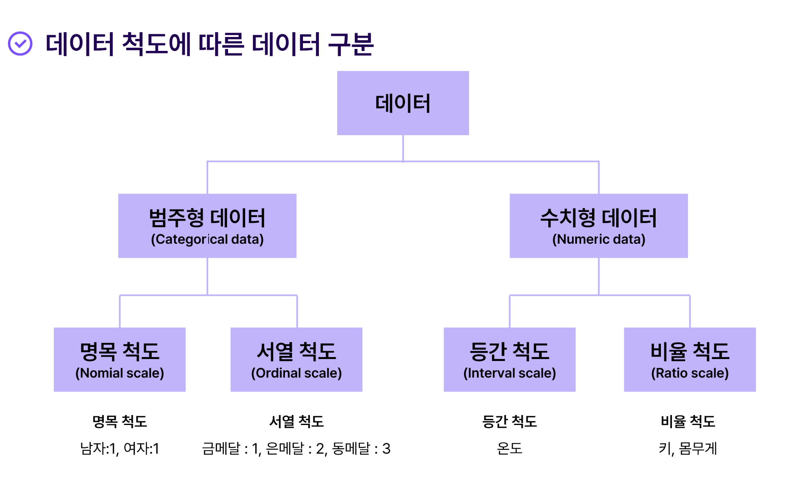
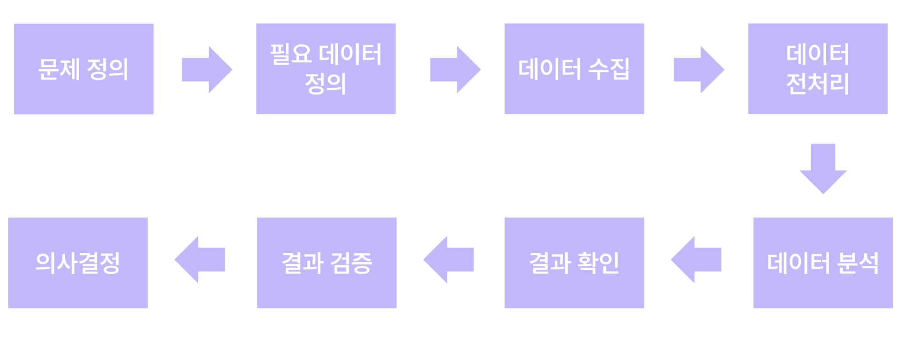
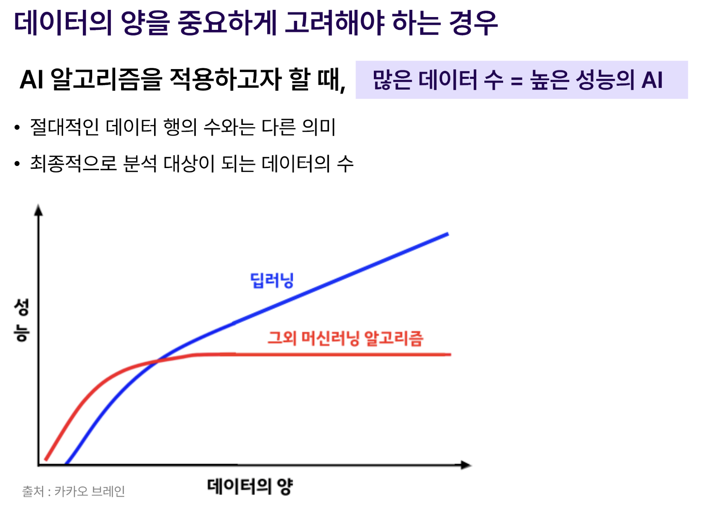
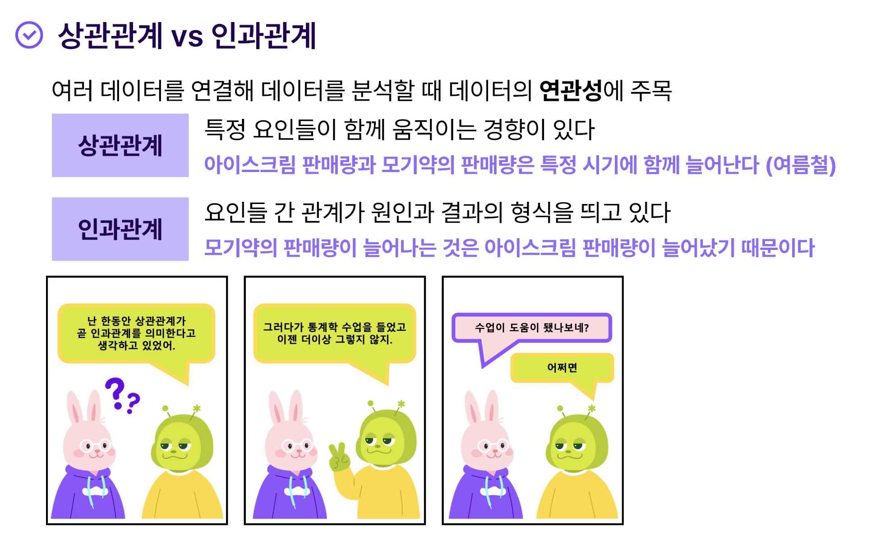

* toc
{:toc .large-only}
이어드림스쿨 CS지식심화 강의를 통해 배운 디자인패턴 관련 내용을 정리한 글입니다. 

<!--more-->

## 데이터

### 데이터 문해력

다양한 데이터를 무조건 분석하는 게 아니라 목적에 맞는 사고를 할 수 있도록 한다.

다양한 데이터를 한데 묶어 우리에게 필요한 데이터를 새롭게 엮어내는 능력

## 데이터의 형식

#### 변수의 종류

- 연속변수 - 연속적인 값을 가지는 변수
  ex) 나이,점수,무게,가격 등
- 범주변수(이산변수) - 서로 다른 것으로 구분되는 변수 
  ex) 성별(남자/여자), 애완동물(강아지/고양이)

#### 척도

측정된 변수의 값을 표현하는 수준(levels of measurement)을 의미

### 정형데이터

미리 정해놓은 형식과 구조가 있어 그에 따라 고정된 자리에 저장된 데이터

#### 명명척도 

- 측정값이 같고 다름을 말할 수 있지만, 측정값들 사이엔 순서가 없는 경우 ex) 혈액형 
- 사칙연산이 불가능하며 종류에 따른 빈도만 계산 가능하다

#### 서열척도

- 측정값들 사이에 순서가 있지만 간격이 동일하지는 않다 ex) 직급(부장, 과장, 대리) / 부장이 과장보다, 과장이 대리보다 높지만 그 차이가 서로 같지는 않다.
- 사칙연산은 불가능

### 비정형데이터 

정의된 구조가 없는 데이터 

#### 등간척도

- 측정값들 사이에 순서가 있고 간격이 일정하다
- 영점(0)의 의미가 임의적 (영점이 옮겨져도 무장함)
- 덧셈,뺄셈이 가능
- ex) 섭씨온도
  - 섭씨20도는 섭씨10도보다 

#### 비율척도

- 등간척도 + 절대영점

- 사칙연산이 모두 가능하다

- 절대 영점이란, 영점의 의미가 아무것도 존재하지 않는 상태를 말한다 

  ex) 길이

  - 20미터는 10미터보다 수치적으로도 2배이고 실제로도 2배 길다 
  - 미터를 피트로 바꿔도 32.8 피트와 65.6 피트로 2배차이가 난다.
  - 영점의 기준이 절대적 (0미터 = 0피트)

#### 척도의 중요성

척도에 따라서 적용가능한 통계 분석방법이 다르기 때문이다.  숫자로 표현 된 경우라 하더라도 무조건 사칙연산이 가능하지는 않다. 그 숫자의 의미(=척도)를 이해해야 제대로된 분석이 가능해진다. 예를 들면 남자=1, 여자=2 와 같은 표현을 하는 경우를 말한다. 가능하면 비율척도나 등간척도의 형태로 자료 수집을 하는 것이 분석에는 용이하다.

ex) 연령을 조사하는 경우

- 서열척도로 조사 : "어린이, 청장년, 노인"과 같이 나누어 조사
- 비율척도로 조사 : 만 나이로 조사 비율척도는 다양한 계산과 분석이 가능하지만, 서열 척도는 어린이 몇 명, 노인 몇 명 등의 분석만 가능하다.

## 데이터 분석 업무 프로세스

1. **문제정의**  

   데이터로 해야하는 문제를 정확히 진단하고 정의하는 것  ex) A라는 상품의 판매량이 갑자기 급감하야 해결방인이 필요

2. **필요 데이터 정의**  

   문제를 해결하기 위해 필요한 데이터를 정의 ex) A 상품 판매실적 데이터, SNS 트래픽 데이터, 마케팅 활동 데이터

3. **데이터 수집** 

    필요한 데이터를 실제로 수집 ex) 사내 시스템을 통해 판매실적 및 마케팅 데이터 확보, 웹 크롤링을 통해 SNS 데이터 확보

4. **데이터 전처리** 

5. **데이터 분석** 

   각종 통계 기법, 인공지능 기법등을 활용하여 초기 목적에 따라 필요한 정보를 도출 데이터의 시각화, 분석 결과 평가를 위한 수치 정량화가 중요 문자발송을 진행한 고객에 대해 A상품 판매 비율이 급감한 것을 파악

6. **결과 확인** 

   분석 결과에 대한 수치적 검증 단계 분석을 통해 파악한 현상이 분할한 데이터에 대해서도 동일하게 발생하는지 확인 ex) 문자 발송을 하지 않은 고객 대비 문자발송 고객이 약 20% 판매량 감소가 있는 것을 확인

7. **결과 검증** 

   새로운 실험을 통하여 데이터 분석 결과에 대한 2차 확인 단계 ex) 소규모 고객에 대해 2차 문자발송으로 해당 고객에서의 판매량 감소 여부 확인

8. **의사 결정** 

   문제원인, 분석 결과를 종합하여 문제 해결을 위한 논의 단계 ex) 문자 어투 수정, 문자발송을 통해 받을 수 있는 혜택 증가 결정

#### 데이터 목적 사고력

- 알고 싶은 내용이 무엇인가? 
- 내용을 알게되면 어떻게 활용할 것인가?
- 이를 위해 필요한 데이터는 무엇인가?

- 데이터를 바라보는 관점
  - 방향성에 대해 멀리서 내다보는 관점
  - 나의 목적에 맞는 데이터를 핵심적으로 도출하는 관점

#### 데이터를 비판적으로 수용하기 위한 체크포인트 

1. 데이터출처 
2. 데이터 날짜
3. 데이터 수집방법
4. 데이터 수집 기관
5. 데이터 크기

> 모집단 - 정보를 얻고자 하는 관심대상 전체집합
>
> 표본(집단) - 모집단의 부분, 집단 속에서 그 일부를 뽑아내어 조사한 결과
>
> (표본의) 대표성 - 표본이 모집단의 성질을 나타냄애 있어 어느 정도의 전형성을 확실히 나타내는지 여부

## 믿을 수 있는 데이터

**데이터편향** - 데이터가 전체 모수(모집단의 특성)를 포괄하지 못하고 특정 표본만을 대표하는 것

**데이터오류** - 데이터가 사실이 아닌 잘못된 정보를 적재하는 경우

**결측 데이터** - 수집 혹은 적재과정에서 누락된 데이터 

## 양질의 데이터를 통한 커뮤니케이션

### 상관관계 vs 인과관계

- 상관관계 - 특정 요인들이 서로 간의 함께 움직이는 경향이 있다는 것을 의미
- 인과관계 - 요인들 간 관계가 원인과 결과 형식을 띄고 있는 것을 의미

### 관계형 데이터베이스

> [빅데이터의 특징] 3V = Velocity + Volume + Variety

다양한 종류의 데이터를 알맞게 구분지어 저장한다. 데이터베이스 양식 중 하나로 데이터를 행(row), 열(column), 테이블(Table)형식으로 저장하여, 서로 관계있는 데이터를 관리하는 양식이다. 

관계형 데이터베이스는 다른 데이터와 결합할 수 있는 가능성이 매우 핵심적이다.  보유한 다른 데이터와 유기적으로 연결하여 넓은 시야로 데이터를 분석하기 위해서는 관계형 데이터베이스 형식이 필수라고 할 수있다. 

* Key - 데이터의 식별자로 이용가능한 속성, 유일성(하나의 키가 하나를 정확히 식별), 무결성(중복되거나 빈값이 아님)을 만족

조건에 맞는 키를 가지는 것이 관계형 데이터 베이스의 핵심이라고 할 수 있다.  키의 존재여부, 조건 만족 여부를 파악하는 것이 모든 데이터 분석의 첫번째 과정이다.

<mark>키 하나만을 보았을 때 그 전체 데이터를 추적할 수 있어야 한다</mark>