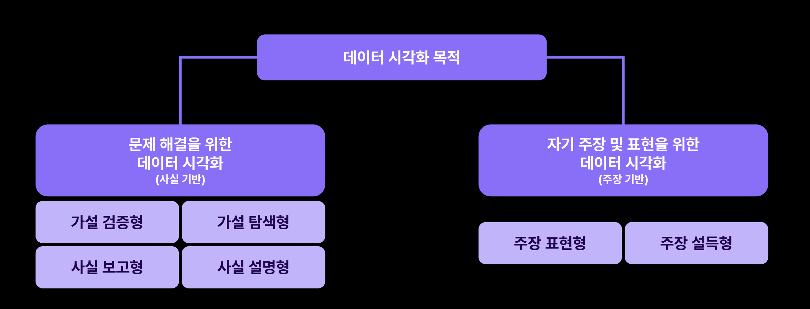
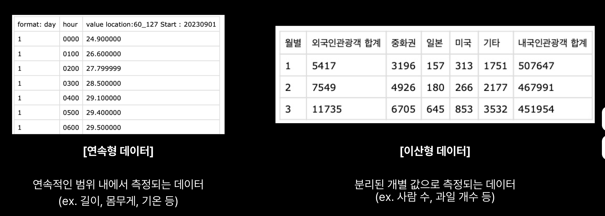
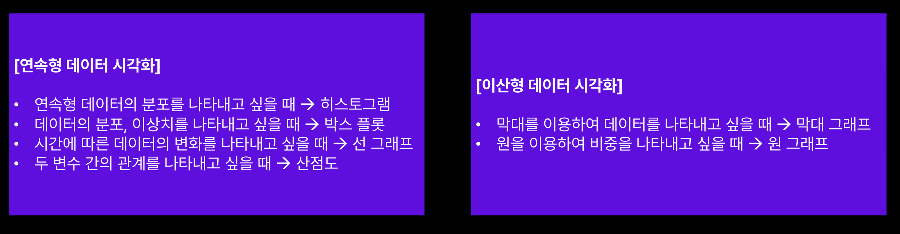
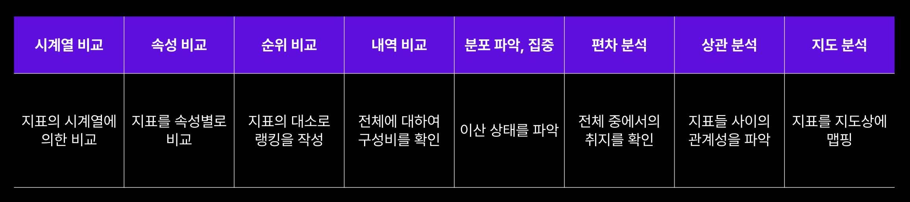

* toc
{:toc .large-only}
이어드림스쿨 7주차 강의 중 데이터 시각화에 대해 학습한 내용을 정리한 글입니다. 

<!--more-->

### 데이터 시각화의 중요성

데이터를 시각화 하기전, 상대방에게 무엇을 전달할건지를 확실하게 정해야한다.

- **가설 검증형** : 가설을 세운다 &rarr; 가설이 사실인지 아닌지 데이터로 증명한다.

- **가설 탐색형** : 막역한 목적 또는 의문이 존재 &rarr; 데이터로부터 가설을 수립한다.
- **사실 보고형** : 정기적으로 확인하고 싶은 지표를 확인 &rarr; 데이터로부터 경향을 파악하고 착안점, 연구해야 할 점을 특징적으로 보여준다.
- **사실 설명형/주장 설득형** : 데이터를 바탕으로 전하고 싶은 일련의 사실과 발견 &rarr; 작성자가 전하고 싶은 것을 읽는 사람이 이해할 수 있도록 한다.
- **주장 표현형** : 데이터를 바탕으로 새로운 표현이나 아름다움을 추구 &rarr; 읽는 사람의 공감과 감동을 촉구한다.

### 데이터의 유형

데이터는 숫자로 표현되는 지를 중점으로 `정량적 데이터`와 `정성적 데이터`로 구분된다.

#### **정량적 데이터** 

- 숫자나 양으로 표현되며 측정 가능한 값을 나타낸다.
- 보통 양적 정보를 나타내며 `연속형` 또는 `이산형`으로 나뉜다.
- 정량적 데이터는 통계 분석, 추론, 예측 및 모델링에 사용된다.

#### 정성적 데이터

- 범주, 품질 또는 특성에 대한 설명을 제공하는 데이터를 의미한다.
- 숫자가 아닌 기술적인 정보로 표현한다. (감정, 성격, 색상, 카테고리, 질문 응답과 같은 주관적인 정보)
- 정성적 데이터는 주로 설문 조사, 인터뷰, 관찰 및 텍스트 데이터와 관련이 있다.
- 데이터의 순서 여부에 따라 `범주 순서형(순서형)`, `범주 비순서형(명목형)` 데이터로 나뉜다.

### 정량적 데이터의 시각화방법

정량적 데이터를 시각화하기 위해서는 데이터의 분포, 관계 추세 및 패턴을 이해하고 이를 효과적으로 전달하기 위해 사용한다. 데이터의 특성과 분포에 따라 다양한 시각화 방법 사용이 가능하다.

### 정성적 데이터의 시각화방법

정성적 데이터는 비정량적이기 때문에 빈도, 비율과 같은 정보를 효과적으로 전달하기 위해 사용한다.  정량적 데이터의 이산형 데이터와 유사한 성질이 있다.

### 데이터 시각화 도구

code 기반의 시각화 도구

장점 

유연성과 커스터마이징 : 프로그래밍 언어를 사용하면 데이터 시각화를 더욱 유연하게 제어 가능하다. 그래프나 차트의 모양, 스타일, 레이아웃 등을 자유롭게  커스터마이징이 가능하다.  

대용량 데이터 처리 : 데이터를 효과적으로 처리하고 시각화 할 수 있다. 

No code 기반의 시각화 도구 

장점

사용자 친화적 : 비전문가도 쉽게 데이터를 시각화하고 생성하고 조작할 수 있다. 사용자가 직관적으로 차트나 그래프를 만들고 수정할 수 있으므로 시각화 작업의 접근성이 높아진다.

빠른 프로토타이핑 : 빠르게 프로토타입을 만들 수 있기 때문에 초기 아이디어 검증과 협업이 용이하다.

- Excel : 
- Tableau, Spotfire : 직관적이고 사용자 친화적인 시각화 도구를 제공하여 데이터를 그래프, 차트, 지도 및 대시보드로 변환하고 시각적으로 분석할 수 있는 프로그램 

#### 용도별 차트 분류 

##### 시계열 비교

어떤 지표가 시간의 흐름에 따라서 어떻게 변화하는 가를 나타낸다.

시계열 관측값을 시각화하면 상승, 하강 등과 같은 경향이나 계절성이나 요일별등의 규칙성(패턴)의 유무도 확인가능하다.

| 목적                                                | 사용그래프           |
| --------------------------------------------------- | -------------------- |
| 기본                                                | 꺾은선 그래프        |
| 수량이나 금액의 양의 추이를 강조                    | 영역 그래프          |
| 전체의 양과 복수의 속성 내역의 추이를 합쳐서 시각화 | 누적영역 그래프      |
| 전체의 양에 구애받지 않고 , 각 속성의 추이를 시각화 | 100% 누적영영 그래프 |

##### 속성 비교

제품별, 고객별, 지점별 등과 같이 지표를 속성별로 분해한 후 비교하여 많음, 적음, 좋음, 나쁨 등과 같은 판단에 도움.

| 목적                                                         | 사용그래프                 |
| ------------------------------------------------------------ | -------------------------- |
| 기본                                                         | 막대 그래프(가로, 세로)    |
| 두 가지의 지표값을 각각 시각화                               | 그라데이션색의 막대 그래프 |
| 매우 많은 속성의 지표값의 크고 작음을 알람표 형식으로 시각화 | 히트맵                     |
| 지표값 그 자체를 정확히 시각화                               | 스코어 카드                |

##### 순위 비교

지표를 속성별로 분해한 후에 큰 순으로 또는 작은 순으로 정렬한다. 속성 비교의 일종으로 비교할 속성의 수가 많을 경우에는 순서를 부여한 후에 상위와 하위 몇 번까지 추출 및 표시할 지를 정해서 주목해야할 범위를 좁히는 것이 효과적이다. 

| 목적                                                | 사용그래프              |
| --------------------------------------------------- | ----------------------- |
| 기본                                                | 막대 그래프 (가로,세로) |
| 시계열로 순위의 변화추이를 시각화                   | 범프 차트(bump chart)   |

##### 내역 비교

지표를 속성별로 분해한 후에 전체에 대해서 내역(구성비, 쉐어)를 표시한다. 속성 비교의 일정이라고 볼 수 있으며 전체를 100%로 했을 때 속성별로 몇 %를 차지하는 지를 비교한다.

| 목적                                                         | 사용그래프                     |
| ------------------------------------------------------------ | ------------------------------ |
| 전체에 대해 3종류 이하의 속성의 구성비를 시각화              | 원 그래프                      |
| 전체에 대해 다수의 속성의 구성비를 시각화                    | 트리 그래프                    |
| 전체의 양과 속성의 구성비를 함께 보이고, 막대 그래프들 사이에서 비교 | 적립형 막대 그래프 (가로,세로) |
| 전체의 양과 속성에 연연하지 않고 속성의 구성비를 보이고, 막대 그래프로 표현하여 비교 | 100% 적립형 막대 그래프        |

##### 분포 파악, 집중

지표를 속성별로 분해한 후에 변화 상태와 확산 상태 (어디에 어느 정도에 해당 속성이 발생하고 있는지)를 나타낸다. 집합에서 현저하게 떨어진 지점에 있는 이상치를 발견하는데 유리하다.

| 목적                                                | 사용그래프             |
| --------------------------------------------------- | ---------------------- |
| 기본                                                | 산포도                 |
| 데이터 전체의 변화 경향을 한눈에 시각화             | 히스토그램(도수분포표) |
| 데이터 변화의 경향을 속성별로 비교                  | 박스 플롯              |

##### 편차 분석

주목하는 특징(명세) 레코드에 대해서 모집단의 평균치와의 차이를 표시한다. 표준편차는 살펴보려는 특정 레코드와 모집단(전체)를 비교함으로써 그에 비해 어느 정도 많은가 혹은 적은가 정도의 의미를 찾는다.

- 중앙값이나 사분위 등의 통계량 속성들 사이에서 비교 - 박스 플롯 

##### 상관 분석

상관 : 일반적으로 두 가지가 서로 영향을 미치는 것

하나의 지표 값이 증가할수록 다른 지표값도 증가하는가 혹은 하나의 지표값이 증가할수록 다른 지표값은 줄어드는가를 확인하는 것이다. 지표값들 사이에 증감이 없다면 상관관계가 없다라고 해석한다.

| 목적                                       | 사용그래프         |
| ------------------------------------------ | ------------------ |
| 2개의 지표치의 관계성을 파악하고 싶은 경우 | 경향선 있는 산포도 |
| 3개의 지표값의 관계성을 파악하고 싶은 경우 | 박스 플롯          |

### 데이터 시각화의 유의사항

- 막대 그래프의 시작점이 0으로 시작하지 않으면 정보를 왜곡할 수 있다.
- 다른 규모의 스케일을 같이 두면 정보가 왜곡 될 수도 있다.
- 파이 그래프는 구성  비율(총합 100%)를 보여주어야 한다.
- 가급적 3차원 그래프는 지양한다. 파이 그래프를 3차원 그래프로 만들면 시점의 차이로 인해 비중이 변경되어 정보가 왜곡될 수 있다.
