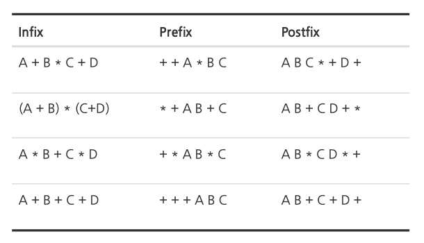
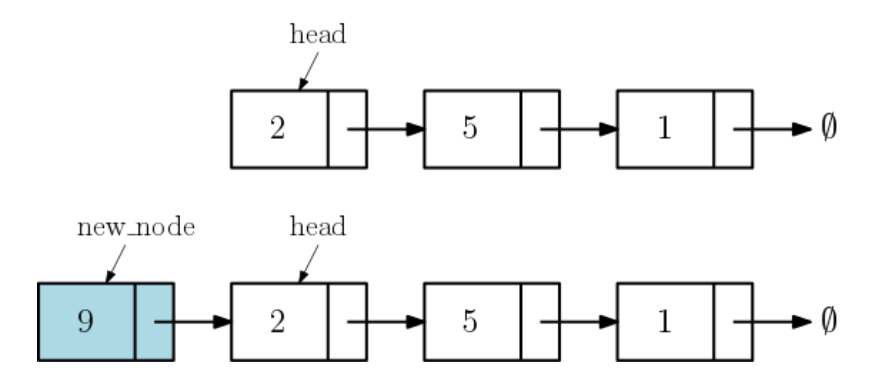
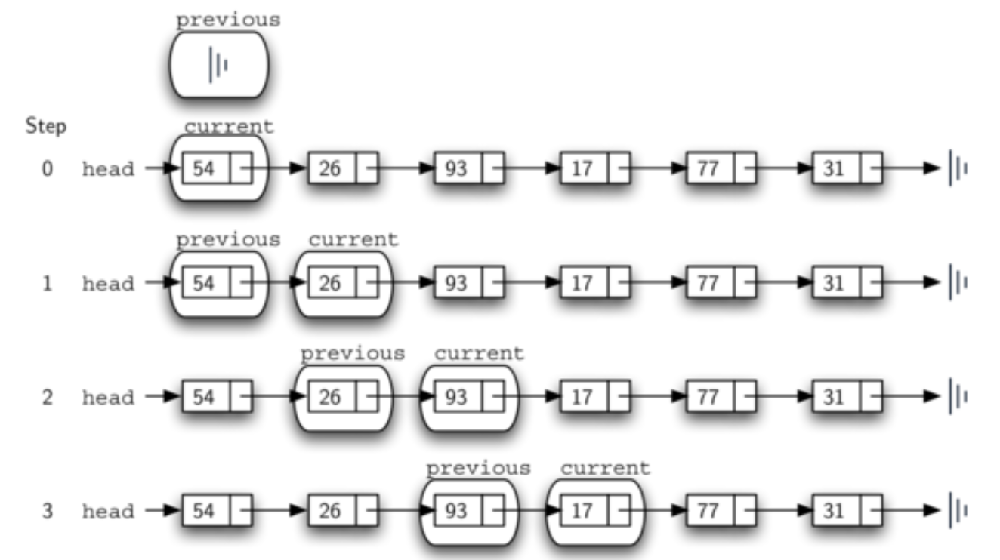
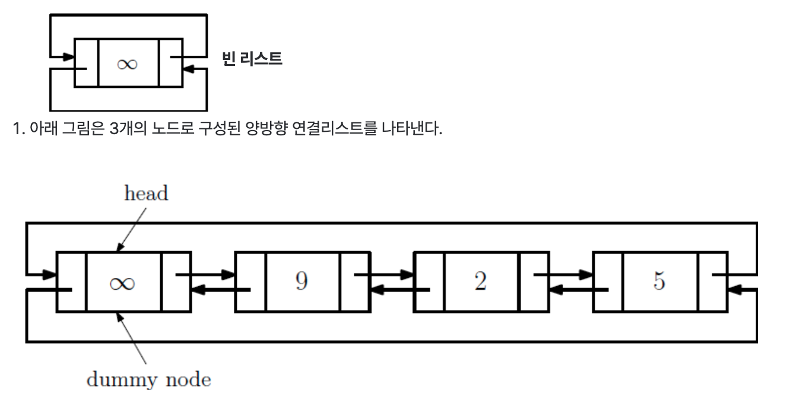
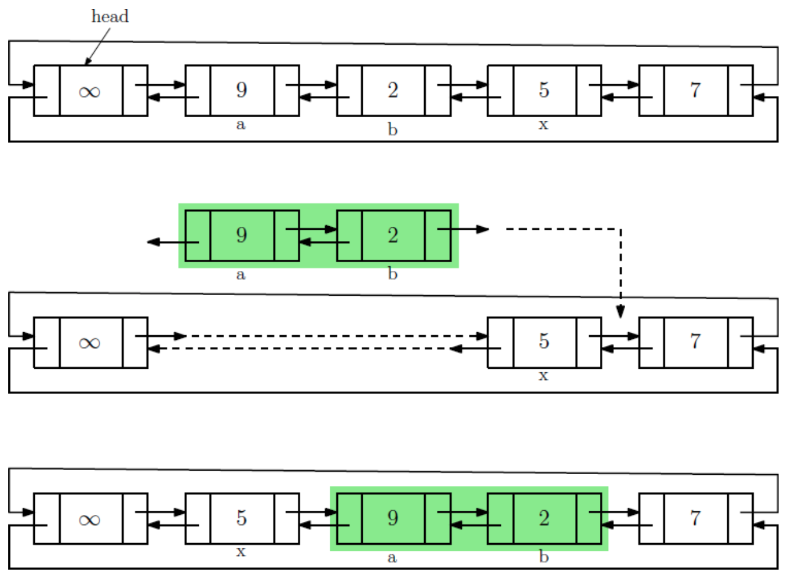

* toc
{:toc .large-only}
[자료구조 - Data Structures with Python](https://www.youtube.com/playlist?list=PLsMufJgu5933ZkBCHS7bQTx0bncjwi4PK)강의를 듣고 정리한 내용입니다.

배열, 리스트, 스택, 큐, 디큐, 연결리스트 등 기본 순차적 자료구조의 개념과 특징을 정리한 글입니다. 각 자료구조의 구조적 차이, 시간복잡도, 사용 예시를 비교하며 핵심 개념을 간결히 설명했습니다. 특히 연결리스트와 동적 배열의 차이를 실제 문제와 연관지어 설명한 점이 특징입니다.


<!--more-->

## 배열(array)

데이터를 연속적인 메모리 공간에 저장하고, 저장된 곳의 주소(address, reference)를 통해 매우 빠른 시간에 접근할 수 있는 가장 많이 쓰이는 기본적인 자료구조.

C,C++,java,python 등의 언어에서는 모두 array 자료구조를 지원한다.


## 리스트(list)

python의 리스트의 셀에는 데이터가 아닌 데이터가 저장된 곳의 주소 (address 또는 reference)가 저장된다.

항상 객체의 주소만 저장하기 때문에, 리스트의 셀의 크기를 메모리 주소에 표현할 수 있는 (4byte)또는 8byte로 고정하면 된다. 모든 셀의 크기가 같기 때문에 index에 의해 `O(1)` 시간으로 접근이 가능하다.

파이썬의 리스트는 읽기/쓰기 이외에 훨씬 더 유연하고 강력한 연산등을 지원한다.

1. **A.append(value)** : 맨 뒤에 새로운 value를 삽입 / `O(1)` 
2. **A.pop(i)** : A[i]을 지우고 리턴 /  `O(1)` 
3. **A.insert(i, value)** : A[i] = value  (단, 값들을 오른쪽으로 한칸씩 이동해 A[i]를 비운 후 저장) /   `O(len(A))`  
4. **A.remove(value**) : value를 찾아서 제거 (value의 오른쪽 값들을 왼쪽으로 한칸씩 이동해 빈 공간을 메움) / `O(n)` 
5. **A.index(value)** : value값이 처음으로 등장하는 index 리턴 / `O(len(A))` 
6. **A.count(value)** : value값이 몇 번 등장하는지 횟수를 세어 리턴 /  `O(len(A))` 
7. **A[i:j]** : A[i] ~ A[j-1]까지를 복사해서 새로운 리스트를 생성한 뒤 리턴 (슬라이싱)

### 리스트 &rarr; 동적배열

파이썬의 리스트는 용량을 자동조절하는 특징을 가진다. 크기가 필요에 따라 자동으로 증가, 감소한다는 것이다.

그렇기 때문에 append 또는 insert 연산을 위한 공간(메모리)이 부족하면 더 큰 메모리를 할당받아 새로운 리스트를 만들고 이전 리스트의 값을 **모두** **이동**한다. 반대로 pop연산을 하면서 실제 저장된 값의 개수가 리스트 크기에 비해 충분히 작다면 더 작은 크기의 리스트를 만들고 **모두 이동**한다.

이렇듯, 필요에 따라 크기가 변하는 배열을 **동적 배열**이라고 부르고 리스트는 이러한 동적 배열이므로 <span style="color:red">사용자는 배열의 크기를 전혀 신경 쓸 필요가 없다.</span>

```python
import sys
a = []
print(sys.getsizeof(a)) #56
a.append(19)
print(sys.getsizeof(a)) #88
```

##  스택(stack)

스택은 `push` 연산으로 값을 차례대로 삽입하고, `pop`연산으로 가장 최근에 저장된 값을 삭제하는 기본적인 자료구조다. 스택에 저장된 값의 갯수를 리턴하는 `len`함수, 가장 나중에 `push`된 값을 삭제하지 않고 리턴하는 `top` 함수 등을 제공할 수 있다.

```python
class Stack:
  def __init__(self):
    self.items = []
  
  def push(self, val):
    self.items.append(val)
   
  def pop(self):
    try:
      return self.items.pop()
    except IndexError:
      print("Stack is empty")
    
  def top(self):
    try:
      return self.items[-1]
    except IndexError:
      print("Stack is empty")
 	
  def __len__(self): # len()으로 호출하면 stack의 item 수 반환
    return len(self.items)
```

구현한 모든 메서드는 모두 `O(1)` 의 시간 복잡도를 갖는다.

### 스택활용 - 계산기 코드

> infix 수식 : 2+3x5  &rarr; postfix  수식 : 2 3 5 x +
>
> 1. 연산 순서에 맞게 괄호치기 (2 + (3 x 5))
> 2. 연산자의 오른쪽 괄호 다음으로 연산자 이동
>
> 

```python
'''
Infix to postfix
'''
class Stack:
    def __init__(self):
        self.items = []

    def push(self, val):
        self.items.append(val)

    def pop(self):
        try:
            return self.items.pop()
        except IndexError:
            print("Stack is empty")

    def top(self):
        try:
            return self.items[-1]
        except IndexError:
            print("Stack is empty")

    def __len__(self):
        return len(self.items)

    def isEmpty(self):
        return self.__len__() == 0


def infix_to_postfix(infix):
    opstack = Stack()
    outstack = []
    token_list = infix.split()

    # 연산자의 우선순위 설정
    prec = {
        '(': 0,
        '+': 1,
        '-': 1,
        '*': 2,
        '/': 2,
        '^': 3
    }

    for token in token_list:
        if token == '(':
            opstack.push(token)
        elif token == ')':
            while not opstack.isEmpty() and opstack.top() != '(':
                outstack.append(opstack.pop())
            opstack.pop()  # '(' 제거
        elif token in prec:
            while (not opstack.isEmpty()) and prec[opstack.top()] >= prec[token]:
                outstack.append(opstack.pop())
            opstack.push(token)
        else:  # 피연산자일 경우
            outstack.append(token)

    # opstack 에 남은 모든 연산자를 outstack으로
    while not opstack.isEmpty():
        outstack.append(opstack.pop())

    return " ".join(outstack)


# 예: 입력은 공백으로 구분된 중위 수식 "2 + 3 * 5"
infix_expr = input("중위 수식을 입력하세요 (공백 구분): ")
postfix_expr = infix_to_postfix(infix_expr)
print("후위 표기식:", postfix_expr)

```

```python
def compute_postfix(postfix):
    stack = []
    tokens = postfix.split()

    for token in tokens:
        if token.replace('.', '', 1).isdigit():  # 소수도 허용
            stack.append(float(token))
        else:
            b = stack.pop()
            a = stack.pop()
            if token == '+':
                stack.append(a + b)
            elif token == '-':
                stack.append(a - b)
            elif token == '*':
                stack.append(a * b)
            elif token == '/':
                stack.append(a / b)
            elif token == '^':
                stack.append(a ** b)

    result = stack[0] if stack else None
    return f"{result:.4f}" if result is not None else "계산 오류"

prefix = input()
answer = compute_postfix(prefix)
print(answer)
```

## 큐(Queue)

큐는 enqueue(스택의 push)로 값을 사입하고, dequeue(스택의 pop)로 가장 처음에 저장 된 값을 삭제하는 기본적인 자료구조이다.

`enqueue, dequeue, front, len, isEmpty` 함수 모두 `O(1)`의 시간 연산이다.

```python
class Queue:
	def __init__(self):
		self.items = []		# 데이터 저장을 위한 리스트 준비
		self.front_index = 0	# 다음 dequeue될 값의 인덱스 저장
		
	def enqueue(self, val):
		self.items.append(val)
		
	def dequeue(self):
		if len(self.items) == 0 or self.front_index == len(self.items):
			print("Queue is empty")
		else:
			x = self.items[self.front_index]
			self.front_index += 1
			return x

	def front(self):
		if len(self.items) == 0 or self.front_index == len(self.items):
			print("Queue is empty")
		else:
			return self.items[self.front_index]

	def __len__(self):	# len()로 호출하면 stack의 item 수 반환
 		return len(self.items)-self.front_index # why?
	
	def isEmpty(self):
		return len(self)
	
Q = Queue()
Q.enqueue(10)
Q.enqueue(4)
print(Q.dequeue())
print(Q.front())
print(Q.dequeue())
print(Q.front())
```

## 디큐(dequeue)

왼쪽과 오른쪽 모두 삽입과 삭제가 가능한 큐 <br>두 가지 버전의  push와 pop연산을 구현하면 되고, 나머지 연산은 Stack, Queue와 유사하게 구현한다. python에는 colletions에 deque가 이미 구현되어있다.

## 연결리스트 (Linked List)

>  파이썬의 **<u>리스트</u>**는 인덱스를 통해 상수시간 `O(1)`에 배열을 읽거나 쓸 수 있다.
>
> 그러나 <u>배열 중간에 값을 삽입하는 경우</u>, 그 위치 오른쪽에 저장된 값은 한 칸씩 오른쪽으로 이동하여 빈 공간을 만들어줘야한다. 최악의 경우  `O(n)` 시간이 필요하고 중간의 값을 삭제하면 역시 오른쪽에 있는 값들이 왼쪽으로 한칸씩 이동해야 하므로 역시 `O(n)`의 시간이 필요할 수 있다.

연결리스트는 배열(파이썬리스트)과 반대로 삽입/삭제가 상수시간 `O(1)`에 이루어지는 자료구조다. 단, 리스트에 저장된 몇 번째 값을 배열처럼 상수시간에 알 수 없고 최악의 시간에 `O(n)`시간이 필요하다.

#### 한방향 연결 리스트 

노드에는 데이터를 위한 속성과 다음 노드에 대한 링크정보(노드의 주소)가 있어야한다.

```python
class Node 
	def __init__(self, key, value=None):
		self.key = key      # 노드에 저장되는 key 값으로 이 값으로 노드를 구분함
		self.value = value  # 추가 정보가 있다면 value에 저장함 (optional)
		self.next = None    # 다음에 연결될 노드(의 주소 또는 reference): 초기값은 None
	
	def __str__(self): 		# print함수를 이용해 출력할 때의 출력 문자열 리턴
		return str(self.key)
```

한방향 연결리스트 클래스는 다음과 같이 선언한다.

1. 연결리스트를 대표하는 노드는 가장 앞의 `head`노드이므로 이 head노드를 기억해아한다.
2. 필요하다면 연결리스트에 연결된 노드의 수를 저장하는  size정보도 포함할 수 있다.

```python
class SinglyLinkedList:
	def __init__(self):
		self.head = None	# head 노드를 저장함
		self.size = 0			# 리스트의 노드 개수를 저장함

	def __str__(self): 	# print() 출력용 문자열 리턴
		s = ""
		v = self.head
		while v:
			s += str(v.key) + " -> "
			v = v.next
		s += "None"
		return s
	
	def __len__(self):		# len(L): 리스트 L의 size 리턴
		return self.size
```

##### 삽입, 삭제

- **`pushFront`** - 리스트 가장 앞에 새로운 노드 삽입

  ```python
  # class SinglyLinkedList의 메서드
  	def pushFront(self, key, value=None):
  		new_node = Node(key, value)
  		new_node.next = self.head
  		self.head = new_node			# head 노드가 바뀜
  		self.size += 1
  ```

​	

- **`pushBack`** - 리스트의 tail 노드 다음에 삽입하기 

  ```python
  	def pushBack(self, key, value=None):
  		new_node = Node(key, value)
  		if self.size == 0:  # empty list --> new_node becomes a head!
  			self.head = new_node
  		else:
  			tail = self.head
  			while tail.next != None:	# follow links until tail
  				tail = tail.next
  			tail.next = new_node
  		self.size += 1
  ```

- **`popFront`** - 리스트의 head 노드 삭제하기

  head가 가리키는 헤드 노드를 리스트에서 삭제한 후, 헤드 노드의 (key,value) 리턴 

  ```python
  	def popFront(self):
  		key = value = None
  		if len(self) > 0:
  			key = self.head.key
  			value = self.head.value
  			self.head = self.head.next
  			self.size -= 1
  		return key, value
  ```

- **`popBack`** - 리스트 가장 뒤(tail) 노드 삭제하기

  가장 뒤에 있는 tail 노드를 리스트에서 삭제한 후, (key,value) 튜플 리턴

  1. 만약 빈 리스트라면 (None, None) 리턴

  2. tail 노드와  tail 노드의 바로 전 previous 노드를 탐색 (previous 노드의 링크 수정필요)

     previous = None, current = head 로 초기화하여 current가 마지막 노드에 도착할 때까지 링크를 하나씩 따라가면서 두 노드를 찾아낸다.

     

  ```python
  	def popBack(self):
  		if self.size == 0: 	# empty list (nothing to pop)
  			return None, None
  		else:
  			# tail 노드와 그 전 노드인 previous를 찾는다
  			previous, tail = None, self.head
  			while tail.next != None:
  				previous, tail = tail, tail.next 	# 한 노드씩 진행
  			# 만약 리스트에 노드가 하나라면 그 노드가 head이면서 동시에 tail임
  			# 그런 경우라면 tail을 지우면 빈 리스트가 되어 head = None으로 수정해야함!
  			key, value = tail.key, tail.value
  			if self.head == tail:	# 또는 if previous == None:
  				self.head = None
  			else:
  				previous.next = tail.next	# previous가 새로운 tail이 됨!
  			self.size -= 1
  			return key, value # key 값만 리턴해도 됨
  ```

  

##### 탐색

- **`search`** 한방향 연결 리스트에서 노드 차례로 방문하기

  key값의 노드를 리턴하거나 없다면 None을 리턴

  ```python
  	def search(self, key):
  		v = self.head
  		while v:
  			if v.key == key:
  				return v
  			v = v.next
  		return None
  ```

- **`generator`**

  python의  generator는 값들을 순차적으로 필요할 때마다 하나씩 생성하여 돌려주는 특수한 형태의 함수이다.

  ```python
  	def __iterator__(self):
      v = self.head
      while v != None:
        yield v
        v = v.next
  ```

  generator를 사용하면 search 함수를 더 간단하게 선언할 수 있다.

  ```python
  	def search(self.key):
      for v in self:	# iterator를 선언해두면 일반 리스트의 for loop처럼 구문작성 가능
        if v.key == key:
          return v
      return None
  ```

  >  **예시)** 정수 n의 약수를 계산하는 함수 
  >
  > - **factor_fun** : 약수들을 모두 만들어 리스트에 담아 리턴
  > - **factor_gen** : `generator`로 약수를 리스트로 만들어 리턴하지 않고,  for문이 반복할 때마다 하나씩 값을 생성해 for문에 전달한다.
  >   - factor_fun에 비해 훨씬 적은 메모리를 사용하고 빠르게 동작한다.
  >   - 생성하는 명령은 `yield`이다.
  >
  > ```python
  > def factor_fun(n):	# return a list of multiples of k in [1..n]
  > 	results = [ ]
  > 	for k in range(1, n+1):
  > 		if n % k == 0:
  > 			results.append(k)
  > 	return results
  > 
  > def factor_gen(n):
  > 	for k in range(1, n+1):
  > 		if n % k == 0:
  > 			yield k   # k를 한 번에 한 값씩 리턴한다
  > 
  > print("-----function-------")
  > for factor in factor_fun(100):
  > 	print(factor, end=' ')
  > print("\n-----generator------")
  > for factor in factor_gen(100):
  > 	print(factor, end=' ')
  > ```

#### 양방향 연결리스트 

한쪽 방향 링크만 있는 경우, 반대 방향의 이웃노드를 `O(1)`에 알 수 없음.  기존 한뱡향 리스트에서 next를 가리키던 정보에 prev를 저장하는 변수를 추가하여 노드를 선언하여 구현한다.

```python
class Node:
  def __init__(self, key=None, value=None):
    self.key = key
    self.value = value
    self.prev = None
    self.next = None
```



1. 양방향 연결리스트는 원형으로 연결된 원형리스트로 관리한다. 원형 리스트의 경우 head노드를 구분하기 쉽지 않기 때문에 dummy 노드를 임의로 설정하여 head node의 구분을 용이하도록 한다. (dummy node는 갯수로 세지는 않는다. 예를 들어 위 그림의 size는 3)

```python
class DoublyLinkedList:	
  def __init__(self):	#dummy head
    self.head = Node()
    self.size = 0
  def __iter__():
  def __str__():
  def __len__():
```

##### 정의, splice

**잘라내기 후 이동하기 연산 splice(a,b)**

양방향 연결리스트에서 노드a와 노드b 사이에 노드를 잘라내서 노드x뒤에 붙이는 연산

<u>조건1</u>) 리스트에서 노드 a 다음에 노드 b가 나와야함 (a==b 일 수는 있음)

<u>조건2</u>) a와 b사이에 head 노드가 없어야함

<u>조건3</u>) a와 b사이에 x가 있어선 안됨

```python
def splice(self, a, b, x): # cut [a..b] after x
	if a == None or b == None or x == None: 
		return
	# 1. [a..b] 구간을 잘라내기 
	a.prev.next = b.next
	b.next.prev = a.prev
	
	# 2. [a..b]를 x 다음에 삽입하기
	x.next.prev = b
	b.next = x.next
	a.prev = x
	x.next = a
```


##### 삽입,삭제,탐색

**`이동` : moveAfter, moveBefore**

- `moveAfter(self,a,x)` == `splice(a,a,x)`
- `moveBefore(self,a,x)` == `splice(a,a,x.prev)`

**`삽입` : insertAfter, insertBefore, pushFront, pushBack**

- `insertAfter(self,a,key)` : key값을 갖는 새 노드를 만들어 a 뒤에 삽입

  == `moveAfter(Node(key), a)`

- `insertBefore(self,a,key)` : key값을 갖는 새 노드를 만들어 a 앞에 삽입

  == `moveBefore(Node(key), a)`

- `pushFront(key)` : key값을 갖는 새 노드를 만들어 맨 앞에 삽입 (dummy node의 뒤)

  == `insertAfter(self.head, key)`

- `pushBack(key)` : key값을 갖는 새 노드를 만들어 맨 뒤에 삽입 (dummny noded의 앞)

  == `insertBefore(self.head, key)`

**`삭제` : deleteNode, popFront, popBack **

- `deleteNode(x)` : 노드 x를 제거한다. 
- `popFront()` : 리스트의 가장 앞 노드 (head.next)의 값을 리턴하고 해당 노드 제거
- `popBack()` : 리스트의 가장 뒷 노드 (head.prev)의 값을 리턴하고 해당 노드 제거

```python
	def deleteNode(self, x): # delete x
		if x == None or x == self.head: 
			return
		# 노드 x를 리스트에서 분리해내기
		x.prev.next, x.next.prev = x.next, x.prev

	def popFront(self):
		if self.head.next == self.head: 
			return None
		key = self.head.next.key
		self.deleteNode(self.head.next)
		return key
	
	def popBack(self):
    if self.head.prev == self.prev: 
			return None
		key = self.head.prev.key
		self.deleteNode(self.head.prev)
		return key
```

