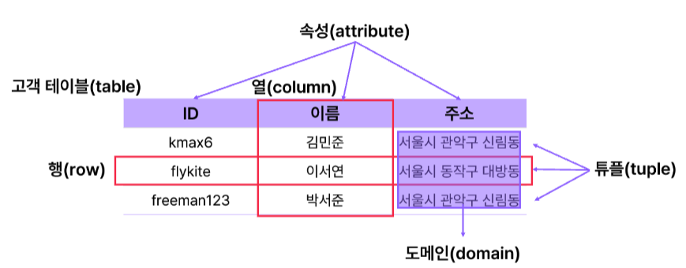

* toc
{:toc .large-only}
이어드림스쿨 SQL 강의를 수강하며 배운 내용을 정리한 글입니다.

관계형 데이터베이스의 개념과 RDBMS의 특징, 기본적인 SQL 분류 및 SELECT 문 구조를 정리하였으며, 단일행 함수와 제약조건, 키의 종류에 대한 설명과 함께 실습 예제 코드도 함께 포함되어 있습니다.

<!--more-->

## 관계형 데이터베이스 (Relational Database)

관계형 데이터베이스(RDB)는 데이터를 **행(Row)** 과 **열(Column)** 로 구성된 **테이블(Table)** 에 저장하고, 이들 테이블 간의 관계를 통해 데이터를 구조화하는 방식입니다.  
이를 체계적으로 관리하고 운영하는 소프트웨어를 **관계형 데이터베이스 관리 시스템(RDBMS)** 이라고 합니다.

### RDBMS의 주요 특징

- **테이블 간 관계**를 통해 데이터를 효과적으로 관리하고 **무결성**을 보장합니다.
- 사전에 정의된 **스키마**에 따라 데이터가 삽입되므로 **데이터 안정성**이 확보됩니다.
- **구조가 일관된 정형 데이터**에 적합합니다.

### 테이블(Table)



- **행(Row)** 또는 **레코드(Record)**: 실제 데이터가 저장되는 단위  
- **열(Column)** 또는 **속성(Attribute)**: 각 필드의 이름과 데이터 형식


### SQL (Structured Query Language)

관계형 데이터베이스와 통신할 때 사용하는 언어로, 데이터를 **생성(C), 조회(R), 수정(U), 삭제(D)** 하는 모든 작업을 수행합니다.

#### SQL 분류

| 분류 | 설명 | 예시 |
|------|------|------|
| DDL (정의) | 데이터 구조 정의 | `CREATE`, `ALTER`, `DROP` |
| DML (조작) | 데이터 조작 | `SELECT`, `INSERT`, `UPDATE`, `DELETE` |
| DCL (제어) | 권한 부여/회수 | `GRANT`, `REVOKE` |
| TCL (트랜잭션 제어) | 트랜잭션 단위 작업 | `COMMIT`, `ROLLBACK` |

```mysql
## DDL
-- 테이블 생성
CREATE TABLE member (
    id INT PRIMARY KEY,
    name VARCHAR(50),
    age INT
);
ALTER TABLE member ADD COLUMN email VARCHAR(100); -- 컬럼추가
ALTER TABLE member MODIFY COLUMN name VARCHAR(100); -- 컬럼수정
ALTER TABLE member DROP COLUMN email; -- 컬럼삭제
DROP TABLE member; -- 테이블삭제

## DCL
-- 유저에게 SELECT, INSERT 권한 부여
GRANT SELECT, INSERT ON testdb.member TO 'coach'@'localhost';
-- coach 유저의 INSERT 권한 회수
REVOKE INSERT ON testdb.member FROM 'coach'@'localhost';

## DML
-- 기본구조
SELECT 컬럼명
FROM 테이블명
WHERE 조건
GROUP BY 그룹기준컬럼
HAVING 그룹조건
ORDER BY 정렬기준;
## 실행순서
## FROM > WHERE > GROUP BY > HAVING > SELECT > ORDER BY
```

### SELECT 문 기본 구조

## 함수(Function)

### 단일행 함수

- &rarr;한 행에서 하나의 결과값을 반환하는 함수
- 사용 가능 위치: `SELECT`, `WHERE`, `ORDER BY`

#### 문자형 함수

```sql
LOWER('ABC') → 'abc'
UPPER('abc') → 'ABC'
LENGTH('SQL') → 3
CONCAT('A', 'B') → 'AB'
SUBSTR('Hello', 2, 3) → 'ell'
```

#### 숫자형 함수

```sql
ABS(-5) → 5
MOD(7, 3) → 1
ROUND(3.456, 2) → 3.46
TRUNC(3.456, 2) → 3.45
```

#### 날짜형 함수

```mysql
SYSDATE → 현재 날짜
SYSDATE + 1 → 내일
SYSDATE - 7 → 7일 전
EXTRACT(YEAR FROM hire_date) → 연도 추출
```

#### 변환 함수

```mysql
TO_CHAR(SYSDATE, 'YYYY-MM-DD')
TO_NUMBER('123') + 1
TO_DATE('2023-12-01', 'YYYY-MM-DD')
```

#### NULL 관련 함수

```sql
NVL(NULL, '대체값') → '대체값'
NULLIF(1, 1) → NULL
COALESCE(NULL, NULL, 3, 4) → 3
```

#### 조건분기함수

```sql
-- CASE
CASE WHEN sal >= 3000 THEN 'HIGH'
     WHEN sal >= 1000 THEN 'MID'
     ELSE 'LOW'
END

-- DECODE
DECODE(position, 'MF', '미드필더', 'FW', '공격수', '교체선수')
```

### 제약조건

| 제약조건      | 설명                |
| ------------- | ------------------- |
| `NOT NULL`    | NULL 입력 불가      |
| `UNIQUE`      | 중복 불가           |
| `PRIMARY KEY` | `NOT NULL + UNIQUE` |
| `FOREIGN KEY` | 참조 무결성 보장    |
| `CHECK`       | 조건 만족 여부 확인 |
| `DEFAULT`     | 기본값 지정         |

#### 제약조건 정의(CONSTRAINT)

```sql
CREATE TABLE kickboard(
    member_id       VARCHAR(16)  NOT NULL,
    member_name     VARCHAR(16)  NOT NULL,
    member_birthday DATE,
    id              VARCHAR(16)  NOT NULL,
    brand           VARCHAR(16)  NOT NULL,   
    rental_location VARCHAR(32)  NOT NULL,
    rental_time     TIME, 
    price           INT          DEFAULT 0,
    CONSTRAINT id_unique UNIQUE (id),
    CONSTRAINT member_birthday_check CHECK (member_birthday < '2000-01-01'),
    CONSTRAINT rental_time_check CHECK(rental_time < '01:00:00')
);
-- kickboard 테이블에 제약 조건을 추가 및 삭제하세요.
ALTER TABLE kickboard
ADD CONSTRAINT unique_member_id UNIQUE (member_id);

ALTER TABLE kickboard
ALTER COLUMN price SET DEFAULT 1000;
```

### 키 

| 키 종류           | 한글명칭 | 설명                                                         |
| ----------------- | -------- | ------------------------------------------------------------ |
| **Primary Key**   | 기본 키  | 테이블에서 각 행(Row)을 **유일하게 식별**하기 위한 속성(또는 속성들의 집합). **NULL 불가**, **중복 불가** 조건을 만족하며, 하나의 테이블에 **오직 하나만 존재**할 수 있음. |
| **Foreign Key**   | 외래 키  | 다른 테이블의 **기본 키(Primary Key)를 참조**하는 키. 두 테이블 간의 **관계를 설정**하며, 참조 무결성을 유지하기 위해 사용됨. |
| **Candidate Key** | 후보 키  | 테이블 내에서 **튜플(행)을 유일하게 식별할 수 있는 속성 집합**으로, 유일성과 최소성을 만족함. **Primary Key로 선택될 수 있는 모든 후보들**을 의미하며, 한 테이블에 여러 개 존재할 수 있음. |
| **Composite Key** | 복합 키  | 하나의 키로 유일성을 보장할 수 없어, **둘 이상의 컬럼을 조합**하여 구성한 키. **복수의 속성을 묶어서 기본 키나 후보 키로 사용**함. |
| **Alternate Key** | 대체 키  | 후보 키(Candidate Key) 중에서, **Primary Key로 선택되지 않은 나머지 키들**. 여전히 유일성과 최소성을 가지며, 필요한 경우 기본 키로 대체 가능함. |


