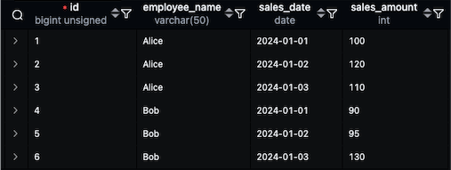

* toc
{:toc .large-only}
이어드림스쿨 SQL 강의와 수강하며 배운 내용을 정리한 글입니다. 

이전 회사에서 윈도우 함수를 학습하며 많은 시행착오를 겪었던 기억이 있어, 이번 기회에 다시 한 번 정리하고자 글을 작성하였습니다. MySQL을 기준으로 윈도우 함수 사용 방법을 정리하였으며, 윈도우 함수를 사용했을 때와 사용하지 않았을 때의 차이점도 함께 비교하여 정리하였습니다.

<!--more-->

## 윈도우 함수

순위, 집계 등 <u>행과 행간에 비교, 연산 정의</u>를 하기위해 사용되는 함수를 의미한다.<br>각 행에 대한 결과를 계산하는 일반적인 집계함수와 달리 <u>행 그룹</u>에 대한 연산을 수행한다.

PARTITION BY를 통해 윈도우를 정의하고 ORDER BY를 사용하여 윈도우 내의 행의 순서를 지정한다.

### 조인과의 차이

- JOIN - 특정 테이블의 특정 컬럼만 보려는 목적

- WINDOW FUNCTION - 특정 테이블의 특정 <span style="color:red">행</span>만 보겠다.

### 구조

```sql
SELECT WINDOW_FUNCTION(arg1, arg2, ..., argN) OVER ([PARTITION BY 컬럼][ORDER BY절][WINDOWING절])
FROM 테이블;
```

| 구조               | 설명                                                         |
| ------------------ | ------------------------------------------------------------ |
| `FUNTION_NAME`     | 사용할 윈도우 함수의 이름                                    |
| `arg1, arg2, arg3` | 함수에 전달되는 파라미터 값                                  |
| `PARTITION BY`     | 파티션을 정의하기 위해 사용되는 열, 결과 집합이 분해되는 기준 |
| `ORDER BY`         | 정렬에 사용되는 열. 윈도우 함수가 적용되는 행의 순서를 결정  |
| `WINDOWING`        | <u>그룹 내 행 순서함수를 사용하여 행을 구분하여 데이터를 가져옴</u><br />`ROWS` - 물리적 단위와 행의 집합을 지정<br />`UNBOUNDING PRECEDING` - 윈도우의 시작 위치가 첫번째 행<br />`UNBOUNDING FOLLOWING` - 윈도우의 마지막 위치가 마지막행<br />`CURRENT ROW`- 윈도위의 시작 위치가 현재 행 |

####  WINDOWING 절
활용예시 

**sales table** 



```sql
-- FIRST VALUE , LAST VALUE
SELECT employee_name, sales_date, sales_amount
	,FIRST_VALUE(sales_amount) 
	 OVER (PARTITION BY employee_name ORDER BY sales_date ROWS BETWEEN UNBOUNDED 		PRECEDING AND CURRENT ROW) AS first_sales
	,LAST_VALUE(sales_amount) 
	 OVER (PARTITION BY employee_name ORDER BY sales_date ROWS BETWEEN UNBOUNDED PRECEDING AND CURRENT ROW) AS last_sales
FROM sales;
+----------------+------------+--------------+-------------+------------+
| employee_name  | sales_date | sales_amount | first_sales | last_sales |
+----------------+------------+--------------+-------------+------------+
|          Alice | 2024-01-01 |          100 |         100 |        100 |
|          Alice | 2024-01-02 |          120 |         100 |        120 |
|          Alice | 2024-01-03 |          110 |         100 |        110 |
|            Bob | 2024-01-01 |           90 |          90 |         90 |
|            Bob | 2024-01-03 |           95 |          90 |         95 |
|            Bob | 2024-01-04 |          130 |          90 |        130 |
+----------------+------------+--------------+-------------+------------+

-- LAG, LEAD
SELECT employee_name, sales_date, sales_amount
	,LAG(sales_amount, 1, 0) 
	 OVER (PARTITION BY employee_name ORDER BY sales_date) AS prev_day_sales
	,LEAD(sales_amount, 1, 0) 
	 OVER (PARTITION BY employee_name ORDER BY sales_date) AS next_day_sales
FROM sales;
+----------------+------------+--------------+----------------+----------------+
| employee_name  | sales_date | sales_amount | prev_day_sales | next_day_sales |
+----------------+------------+--------------+----------------+----------------+
|          Alice | 2024-01-01 |          100 |              0 |            120 |
|          Alice | 2024-01-02 |          120 |            100 |            110 |
|          Alice | 2024-01-03 |          110 |            120 |              0 |
|            Bob | 2024-01-01 |           90 |              0 |             95 |
|            Bob | 2024-01-03 |           95 |             90 |            130 |
|            Bob | 2024-01-04 |          130 |             95 |              0 |
+----------------+------------+--------------+----------------+----------------+

-- ROWS BETWEEN 2 PRECEDING AND CURRENT ROW
SELECT employee_name, sales_date, sales_amount
	,ROUND(AVG(sales_amount) 
	OVER (PARTITION BY employee_name ORDER BY sales_date ROWS BETWEEN 2 PRECEDING AND CURRENT ROW), 2) AS avg_3_days
FROM sales;
+----------------+------------+--------------+-------------+
| employee_name  | sales_date | sales_amount | avg_3_days  |  
+----------------+------------+--------------+-------------+
|          Alice | 2024-01-01 |          100 |      100.00 | 
|          Alice | 2024-01-02 |          120 |      110.00 |
|          Alice | 2024-01-03 |          110 |      110.00 |  
|            Bob | 2024-01-01 |           90 |       90.00 |
|            Bob | 2024-01-03 |           95 |       92.50 | 
|            Bob | 2024-01-04 |          130 |      105.00 | 
+----------------+------------+--------------+-------------+
```

### 종류

[PostgreSQL 윈도우 함수 공식문서](https://www.postgresql.org/docs/14/functions-window.html)

[MySQL 윈도우 함수 공식문서](https://dev.mysql.com/doc/refman/8.4/en/window-function-descriptions.html#function_rank)

### 순위함수 (RANK/DENSE_RANK/ROW_NUMBER)

⚠️ 별도의 argument를 받지 않음 

| 함수       | 설명                                                        |
| ---------- | ----------------------------------------------------------- |
| RANK       | 동일한 값에는 동일한 순위를 부여                            |
| DENSE_RANK | RANK와 같이 같은 값에는 같은 순위를 부여하나 한 건으로 취급 |
| ROW_NUMBER | 동일한 값이라도 고유한 순위를 부여                          |

```mysql
SELECT val,
  ROW_NUMBER() OVER w AS 'row_number',
  RANK()       OVER w AS 'rank',
  DENSE_RANK() OVER w AS 'dense_rank'
FROM numbers
WINDOW w AS (ORDER BY val);
+------+------------+------+------------+
| val  | row_number | rank | dense_rank |
+------+------------+------+------------+
|    1 |          1 |    1 |          1 |
|    1 |          2 |    1 |          1 |
|    2 |          3 |    3 |          2 |
|    3 |          4 |    4 |          3 |
|    3 |          5 |    4 |          3 |
|    3 |          6 |    4 |          3 |
|    4 |          7 |    7 |          4 |
|    4 |          8 |    7 |          4 |
|    5 |          9 |    9 |          5 |
+------+------------+------+------------+
```

### 그룹 내 비율 함수

| 함수            | 설명                                                         | 계산 방식              | 최소값 | 최대값 | 동일값 처리 |
| --------------- | ------------------------------------------------------------ | ---------------------- | ------ | ------ | ----------- |
| RATIO_TO_REPORT | 전체 합계 대비 비율<br />파티션 내 전체 SUM에 대한 비율을 구한다 | `val / SUM(val)`       | 0      | 1      | 값 기준     |
| PERCENT_RANK    | 백분위 순위<br />파티션 내 순위를 백분율로 구한다            | `(rank - 1) / (n - 1)` | 0      | 1      | 동일 순위   |
| CUME_DIST       | 누적 분포<br />파티션 내 현재 행보다 작거나 같은 건들의 수 누적 백분율로 구한다 | `누적 행 수 / n`       | 0      | 1      | 포함        |
| NTILE(n)        | 그룹 나누기<br />파티션 내 행들을 N등분한 결과를 구한다<br />*홀수 개인 경우, 가장 윗그룹 부터 1개씩 더 배분* | n등분된 버킷 번호      | 1      | n      | 개별 배정   |

```sql
SELECT val, val/SUM(val) OVER () AS 'ratio_to_report'
FROM numbers;
+------+------------------+
| val  | ratio_to_report  |
+------+------------------+
|    1 | 0.0454545455     |
|    1 | 0.0454545455     |
|    2 | 0.0909090909     |
|    3 | 0.1363636364     |
|    3 | 0.1363636364     |
|    3 | 0.1363636364     |
|    4 | 0.1818181818     |
|    4 | 0.1818181818     |
|    5 | 0.2272727273     |
+------+------------------+

SELECT val, PERCENT_RANK() OVER (ORDER BY val) AS 'percent_rank'
FROM numbers;
+------+--------------+
| val  | percent_rank |
+------+--------------+
|    1 |        0.000 |
|    1 |        0.000 |
|    2 |        0.250 |
|    3 |        0.375 |
|    3 |        0.375 |
|    3 |        0.375 |
|    4 |        0.750 |
|    4 |        0.750 |
|    5 |        1.000 |
+------+--------------+

SELECT val, CUME_DIST() OVER (ORDER BY val) AS 'cume_dist'
FROM numbers;
+------+-----------+
| val  | cume_dist |
+------+-----------+
|    1 | 0.2222222 |
|    1 | 0.2222222 |
|    2 | 0.3333333 |
|    3 | 0.6666666 |
|    3 | 0.6666666 |
|    3 | 0.6666666 |
|    4 | 0.8888888 |
|    4 | 0.8888888 |
|    5 | 1.0000000 |
+------+-----------+

SELECT val, NTILE(4) OVER (ORDER BY val) AS 'ntile_4'
FROM numbers;
+------+----------+
| val  | ntile_4  |
+------+----------+
|    1 |        1 |
|    1 |        1 |
|    2 |        2 |
|    3 |        2 |
|    3 |        3 |
|    3 |        3 |
|    4 |        3 |
|    4 |        4 |
|    5 |        4 |
+------+----------+
```

### 그룹함수

