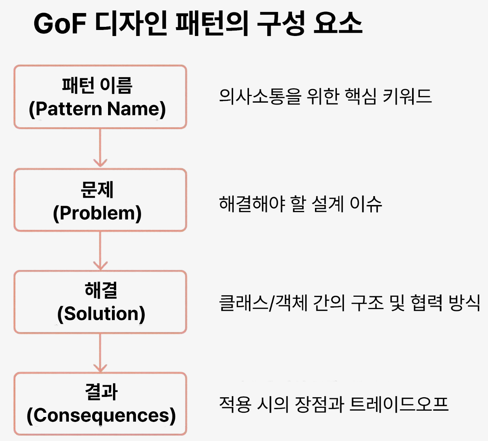

* toc
{:toc .large-only}
이어드림스쿨 CS지식심화 강의를 통해 배운 디자인패턴 관련 내용을 정리한 글입니다. 

<!--more-->

## 디자인패턴

소프트웨어 설계의 검증된 해결책을 정형화한 설계의 모범사례 템플릿 

- 반복적으로 등장하는 SW 설계 문제에 대한 재사용 가능한 해결책
- 기능 중심에서 클래스/객체 간 구조와 상호작용을 위한 설계 템플릿으로 발전
- 구현이 아닌 설계의 Best Practice

### 디자인 패턴의 장,단점

| 장점                        | 단점                                 |
| --------------------------- | ------------------------------------ |
| 검증된 설계 지침 제공       | 과도한 사용시 복잡도 증가            |
| 코드 재사용성과 확장성 증가 | 잘못 사용할 경우 코드 품질 저하      |
| 팀 간 의사소통 용이         | 패턴에 대한 학습이 추가적으로 필요함 |

### GoF 디자인 패턴

총 23가지의 생성, 구조, 행위 패턴으로 체계적으로 분류되어 있음

#### 생성

객체 생성 방식을 추상화하여 유연하고 유지보수가 쉬운 구조를 설계할 수 있도록 한다. 객체 생성이 시스템에 주는 영향을 쵯고화하고 생성 책임을 명확히 분리한다. 

- 목적 : 객체 생성 방식을 숨기고, 객체 생성을 통제한다. 
- 효과 : 시스템 복잡도 감소, 생성 코드 재사용성 증가

| 패턴                                        | 설명                                                         |
| ------------------------------------------- | ------------------------------------------------------------ |
| 팩토리 메서드 패턴 (Factory Method Pattern) | 상위 클래스에서 객체를 생성하는 인터페이스를 정의하고, 하위 클래스에서 인스턴스를 생성하는 방식 상위 클래스에서는 객체를 만들기 위한 인터페이스만 정의하고, 실제 어떤 객체를 만들지는 하위클래스에서 결정한다.  코드 의존성이 줄고 OCP 원칙에도 부합한다. |
| 싱글턴 패턴 (Singleton Pattern)             | 전역 변수를 사용하지 않고 객체를 하나만 생성한다.  생성된 객체를 어디에서든지 참조할 수 있도록 하는 패턴. |
| 프로토타입 패턴 (Prototype Pattern)         | 프로토타입을 먼저 생성하고 인스턴스를 복제하여 사용하는 구조 일반적인 방법으로 객체를 생성하며, 비용이 많이 소요되는 경우에 주로 사용한다. |
| 빌더 패턴 (Builder Pattern)                 | 복잡한 개체를 생성하기 위해 다양한 객체들을 조합하는 방식을 제공한다. 객체를 생성하는 방식을 분리함으로써, 객체 생성의 유연성과 확장성을 높인다. |
| 추상 팩토리 패턴 (Abstract Factroy Pattern) | 서로 연관되거나 의존적인 객체들의 조합을 만들어 인터페이스를 제공하는 패턴 구체적인 클래스에 의존하지 않으며, 관련된 서브 클래스를 그룹지어 한번에 교체 가능 |

#### 구조

클래스나 객체를 조합하여 더 큰 구조를 만들기 위한 패턴. 다양한 객체나 인터페이스를 유연하게 조합하여 기능을 확장할 수 있도록 도와준다.

- 목적 : 복잡한 시스템의 구조 설계를 단순화 
- 활용 : 자료구조 설계, 인터페이스 조합, 객체 간 연결

| 패턴                                  | 설명                                                         |
| ------------------------------------- | ------------------------------------------------------------ |
| 어댑터 패턴 (Adapter Pattern)         | 클래스의 인터페이스를 다른 인터페이스로 변환하여 다른 클래스가 이용할 수 있도록 도와주는 패턴 |
| 브리지 패턴 (Bridge Pattern)          | 구현부에서 추상층을 분리하여 각자 독립적으로 확장할 수 있게 도와주는 패턴 |
| 컴포지트 패턴 (Composite Pattern)     | 객체들의 관계를 트리구조로 구성하여 복합 객체와 단일 객체를 구분없이 다루는 패턴 |
| 데코레이터 패턴 (Decorator Pattern)   | 주어진 상황 및 용도에 따라 어떤 객체에 다른 객체를 덧붙이는 방식 |
| 퍼사드 패턴 (Facade Pattern)          | 서브 시스템에 있는 인터페이스 집합에 대해 하나의 통합된 인터페이스 (Wrapper)를 제공하는 방식 |
| 플라이웨이트 패턴 (Flyweight Pattern) | 크기가 작은 여러개의 객체를 매번 생성하지 않고 가능한 공유할 수 있도록 하여 메모리를 절약하는 패턴 |
| 프록시 패턴 (Proxy Pattern)           | 접근이 어려운 객체에 접근할 수 있는 인터페이스의 역할을 수행하는 방식 |

#### 행위

클래스나 객체 사이의 행위에 초점을 맞춘 패턴으로, **객체간의 책임 분산, 메세지 전달 방식, 알고리즘 구조** 등을 정의한다.

- 목적 : 객체들 간 상호작용 설계
- 핵심 : 누가 어떤 책임을 가지고 어떻게 협력할 것인가를 정리
